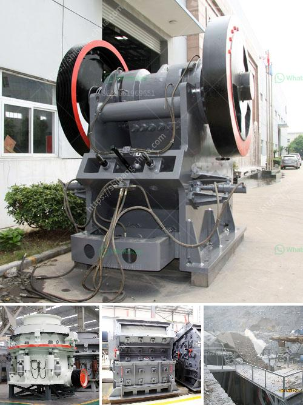

<h3>m sand crusher in tirunelveli</h3>
In recent years, the demand for sand has increased exponentially due to rapid urbanization and industrialization. However, the extraction of natural sand from rivers and beaches has led to environmental concerns and scarcity of this precious resource. To address these challenges, innovative alternatives like M-sand (manufactured sand) have emerged as a solution for sustainable construction. One such facility that has been spearheading the production of M-sand in Tirunelveli is the M-sand Crusher.

Tirunelveli, a district in Tamil Nadu, India, has always been known for its rich reserves of natural sand. However, with the growing demand for construction materials, the traditional methods of sand extraction became unsustainable and harmful to the environment. In response to this critical situation, the M-sand Crusher was established in Tirunelveli with the aim of producing high-quality M-sand using advanced crushing technology.

M-sand, also known as manufactured sand, is a substitute for natural sand obtained from the crushing process of hard granite stone. The presence of cubical particles allows M-sand to offer superior strength and durability, making it an ideal choice for various construction applications. Moreover, the uniform size distribution and consistent quality of M-sand ensure optimum workability and reduce the need for excessive water or cement usage in concrete mixtures.

The M-sand Crusher in Tirunelveli operates with state-of-the-art equipment that supports efficient and sustainable production. The primary crushing unit consists of a feeder, jaw crusher, and VSI (vertical shaft impactor) crusher. The secondary crushing unit, which is commonly known as the screening unit, consists of a triple-deck vibrating screen and conveyors for further processing. This integrated system ensures the production of high-quality M-sand through a well-regulated crushing process.

One of the key advantages of the M-sand Crusher is its ability to produce sand that meets the required specifications, irrespective of the initial rock properties. It ensures consistency in particle size, shape, and gradation, which are essential factors for producing high-strength and durable concrete. The M-sand produced at this facility is extensively tested for various quality parameters like particle size distribution, silt content, and presence of deleterious substances to ensure compliance with industry standards.

Moreover, the M-sand Crusher in Tirunelveli strictly adheres to environmental regulations and continues to invest in advanced technologies for waste management and pollution control. The production process is designed in a manner that minimizes the generation of fines and waste materials. The facility also features a proper water management system to prevent the contamination of nearby water bodies and ensure responsible use of water resources.

The availability of M-sand in Tirunelveli has led to a significant reduction in the dependence on natural sand, thereby addressing environmental concerns like river erosion and groundwater depletion. It has also resulted in cost savings for builders and developers, as M-sand is relatively less expensive compared to other alternatives.

In conclusion, the establishment of the M-sand Crusher in Tirunelveli has revolutionized the construction industry by providing a sustainable and eco-friendly solution. The production of high-quality M-sand using advanced crushing technology ensures the availability of a consistent construction material that meets the required specifications. As the demand for sand continues to rise, such facilities play a vital role in ensuring efficient and responsible use of natural resources for a greener and more sustainable future.
<h3>Contact us</h3><ul><li><strong>Whatsapp:&nbsp;<a href="https://wa.me/8613661969651">+8613661969651</a></strong></li><li><a href="https://swt.shibang-china.com/?git&amp;zhl&amp;m sand crusher in tirunelveli"><strong>Online Service(chat now)</strong></a></li></ul><h3>Related</h3><ul><li><a href='india copper mining equipment.md'>india copper mining equipment</a></li><li><a href='ball mill in wait of ball.md'>ball mill in wait of ball</a></li><li><a href='small ball mill for alumina.md'>small ball mill for alumina</a></li><li><a href='dolomite crushers for sale.md'>dolomite crushers for sale</a></li><li><a href='mobile stone crusher machine price.md'>mobile stone crusher machine price</a></li></ul>