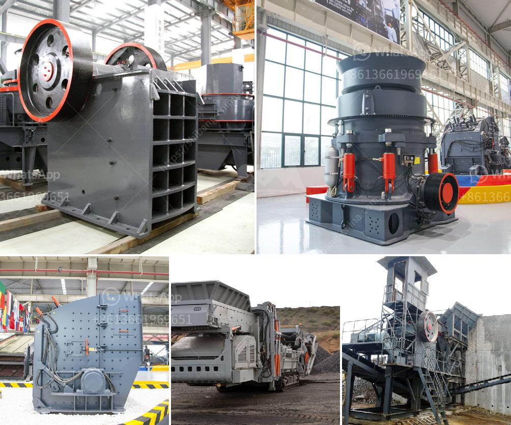

<h3>machinery for magnesium extracted from dolomite</h3>
Magnesium, a lightweight and highly versatile metal, has become an essential component in various industries. This valuable metal has numerous applications, ranging from aerospace and automotive industries to medical advancements and consumer electronics. However, extracting magnesium from its primary source, dolomite, has remained a labor-intensive and energy-consuming process. Fortunately, the development of advanced machinery for magnesium extraction from dolomite has revolutionized the industry and opened up new possibilities.

Dolomite, a mineral compound consisting of calcium magnesium carbonate, is abundantly found in many regions around the world. To obtain pure magnesium metal, dolomite first undergoes a process known as calcination, which involves heating and decomposing the mineral at high temperatures. Traditionally, this process has required substantial energy inputs and a complex series of chemical reactions, making it inefficient and costly.

The introduction of innovative machinery has significantly simplified and optimized the magnesium extraction process from dolomite. These advanced machines leverage cutting-edge technologies like thermal cracking, electrolysis, and chemical reduction, drastically reducing the energy consumption and improving the overall efficiency of the process.

One such machine is the thermal cracking furnace, a crucial component in the extraction process. This furnace employs high temperatures to facilitate the breakdown of dolomite, enabling the release of magnesium vapor. Subsequently, the vapor is condensed and collected, resulting in pure and highly refined magnesium metal. The adoption of thermal cracking furnaces has elevated the magnesium extraction industry to new heights, reducing costs and minimizing the environmental impact.

Furthermore, machinery designed for the electrolysis of magnesium chloride has emerged as another breakthrough in the industry. Dolomite-derived magnesium chloride, after several purification steps, can be transformed into magnesium metal through electrolysis. Sophisticated electrolysis machines utilize an electric current to separate the magnesium ions from the chloride ions, yielding pure magnesium metal as a byproduct.

In addition to thermal cracking furnaces and electrolysis machines, chemical reduction reactors have also played a vital role in streamlining the magnesium extraction process. These reactors facilitate the chemical reactions necessary to acquire magnesium metal, resulting in improved purity and yield. With efficient and automated chemical reduction reactors, large-scale magnesium production has become economically viable and affordable.

The introduction of machinery for magnesium extraction from dolomite has undoubtedly transformed the industry and paved the way for increased magnesium utilization in various sectors. Manufacturers can now rely on cost-effective, sustainable, and high-quality magnesium production, ensuring a steady supply of this valuable metal. Additionally, the enhanced efficiency of the extraction process contributes to reducing the environmental impact associated with magnesium production, aligning with the growing global focus on sustainability.

As the demand for magnesium continues to rise, advancements in machinery will continue to play a fundamental role in meeting this demand. The ongoing research and development efforts within this field promise even more efficient, cost-effective, and eco-friendly methods for magnesium extraction from dolomite, further benefiting industries and driving innovation.

In conclusion, the introduction of advanced machinery for magnesium extraction from dolomite has revolutionized the industry. Through thermal cracking furnaces, electrolysis machines, and chemical reduction reactors, the extraction process has become more efficient, cost-effective, and environmentally friendly. As a result, manufacturers can meet the growing demand for magnesium and explore new applications in various sectors, ensuring a brighter future for this versatile metal.
<h3>Contact us</h3><ul><li><strong>Whatsapp:&nbsp;<a href="https://wa.me/8613661969651">+8613661969651</a></strong></li><li><a href="https://swt.shibang-china.com/?git&amp;zhl&amp;machinery for magnesium extracted from dolomite"><strong>Online Service(chat now)</strong></a></li></ul><h3>Related</h3><ul><li><a href='jaw crusher in nigeria.md'>jaw crusher in nigeria</a></li><li><a href='ball mills in autocad.md'>ball mills in autocad</a></li><li><a href='mining screens and crushing equipment.md'>mining screens and crushing equipment</a></li><li><a href='china dahua series jaw crusher.md'>china dahua series jaw crusher</a></li><li><a href='price of zenith crusher.md'>price of zenith crusher</a></li></ul>