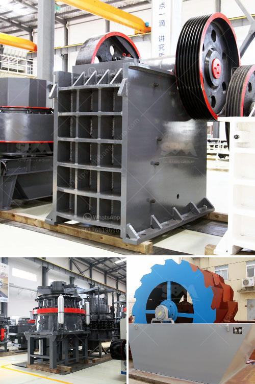

<h3>machinery for manufacturing of artificial granite</h3>
The stone industry has undergone a significant transformation in recent years, with the introduction of machinery for the manufacturing of artificial granite. This innovative technology has revolutionized the production of synthetic stones, offering numerous advantages over natural granite while maintaining the same aesthetic appeal. In this article, we will explore the various aspects of machinery used in the manufacturing process of artificial granite and delve into the benefits it brings to both manufacturers and consumers.

Artificial granite, also known as engineered stone, is a composite material made by combining crushed stone, resins, and pigments. It imitates the appearance of natural granite, offering a wide range of colors and patterns to suit diverse design preferences. The machinery used in its manufacturing plays a crucial role in creating a high-quality end product with consistent results.

One of the key components in the machinery for manufacturing artificial granite is the mixing plant. This plant ensures the correct combination of crushed stone, resins, and pigments in the right proportions. The accurate mixing of these materials is vital to achieve the desired color and pattern variations. Advanced mixing plants utilize computerized systems to precisely control the mixing process and maintain consistency throughout the production cycle.

Once the materials are properly mixed, they are poured into molds of various sizes and shapes. The molds are then placed in a high-pressure vacuum chamber, where the air is removed to ensure proper compaction. This vacuuming process eliminates any potential air pockets or voids, resulting in a dense and durable artificial granite slab.

After the compaction process, the molds are moved to a curing chamber where heat and pressure are applied to accelerate the hardening of the resin. This enables the artificial granite to achieve high tensile strength and resistance to impact, making it a superior alternative to natural granite.

The machinery used for manufacturing artificial granite also includes cutting and polishing equipment. These machines are responsible for transforming the cured slabs into the desired finished products, such as kitchen countertops, bathroom vanities, and floor tiles. Advanced automatic cutting and polishing machines ensure precision and efficiency, reducing the need for manual labor and increasing overall productivity.

Artificial granite has gained significant popularity due to its numerous advantages over natural granite. Firstly, it is non-porous, making it resistant to staining, bacterial growth, and moisture damage. This characteristic makes artificial granite a hygienic choice for kitchen and bathroom surfaces. Additionally, artificial granite is highly resistant to heat and scratching, making it a durable and long-lasting material. It also offers a more affordable option compared to natural granite, allowing homeowners and business owners to achieve a luxurious aesthetic at a lower cost.

In conclusion, machinery for manufacturing artificial granite has revolutionized the stone industry. By combining crushed stone, resins, and pigments, this advanced technology offers consistent results and a wide range of color and pattern options. The machinery ensures accurate mixing, proper compaction, and efficient cutting and polishing, resulting in high-quality and durable products. With its many advantages over natural granite, artificial granite has become a popular choice for various applications, bringing innovation and affordability to the market.
<h3>Contact us</h3><ul><li><strong>Whatsapp:&nbsp;<a href="https://wa.me/8613661969651">+8613661969651</a></strong></li><li><a href="https://swt.shibang-china.com/?git&amp;zhl&amp;machinery for manufacturing of artificial granite"><strong>Online Service(chat now)</strong></a></li></ul><h3>Related</h3><ul><li><a href='19mm crusher stone philippines quarry.md'>19mm crusher stone philippines quarry</a></li><li><a href='grinding ball mill price.md'>grinding ball mill price</a></li><li><a href='concrete stone crusher uk for sale.md'>concrete stone crusher uk for sale</a></li><li><a href='price of stone crushing machine in nigeria.md'>price of stone crushing machine in nigeria</a></li><li><a href='manufacturers crushing stone.md'>manufacturers crushing stone</a></li></ul>