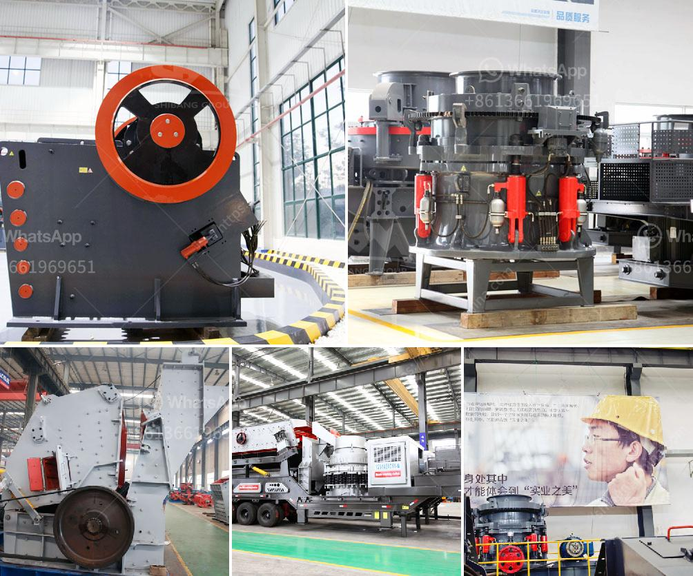

<h3>machinery required for stone crusher</h3>
Stone crushers are widely used in the mining and construction industry to crush stones into small pieces for aggregate and sand production. These machines come in different sizes and types, each having their own specific applications. So, let’s take a closer look at the different types of machinery required for stone crushers.

Firstly, the primary crusher is required to break down the large stones into smaller particles. This is usually accomplished by a jaw crusher, a high-speed, large-scale machine that uses compressive force to crush the stones. Jaw crushers are the most commonly used primary crushers due to their high capacity and ability to handle hard, abrasive materials.

Next, the secondary crusher is utilized to further reduce the size of the stones. Cone crushers are commonly used for secondary crushing as they provide an excellent shape and fine particle size. These crushers work by squeezing the material between an eccentrically gyrating mantle and a concave, which is fixed in the main frame.

Additionally, impact crushers are another type of secondary crusher that can be used in specific applications. These machines work by throwing the stones against a hard surface, causing them to break into smaller pieces. Impact crushers are often used for producing high-quality aggregates for road construction and concrete production.

After the stones have been crushed to the desired size, they need to be screened to ensure uniformity. Vibrating screens are commonly employed for this purpose. These screens have multiple layers of meshes or perforated plates that allow the fine particles to pass through while retaining the larger stones. By separating the stones into different size fractions, the aggregate can be used for various purposes.

In addition to the crushers and screens, other auxiliary equipment is also required for the stone crushing process. For instance, belt conveyors play an essential role in transporting the stones from one machine to another. They ensure a continuous flow of material and help to optimize productivity.

Furthermore, dust suppression systems are crucial to control the emission of dust particles generated during the crushing process. These systems typically consist of water sprays or misting systems that dampen the dust and prevent it from becoming airborne. This is essential for maintaining a healthy work environment and complying with environmental regulations.

Moreover, power supply units are necessary to provide electricity to operate the stone crushers and other associated machinery. Depending on the location and availability of power, different types of generators or transformers may be required to ensure uninterrupted operations.

To summarize, the machinery required for stone crushers includes primary and secondary crushers, vibrating screens, belt conveyors, dust suppression systems, and power supply units. Each of these machines plays a crucial role in the stone crushing process and contributes to the overall efficiency and productivity of the operation. Therefore, it is important to carefully choose and maintain the machinery to ensure its optimal performance. By doing so, stone crushing operations can be conducted smoothly, efficiently, and in compliance with all relevant safety and environmental standards.
<h3>Contact us</h3><ul><li><strong>Whatsapp:&nbsp;<a href="https://wa.me/8613661969651">+8613661969651</a></strong></li><li><a href="https://swt.shibang-china.com/?git&amp;zhl&amp;machinery required for stone crusher"><strong>Online Service(chat now)</strong></a></li></ul><h3>Related</h3><ul><li><a href='price of conveyor belts.md'>price of conveyor belts</a></li><li><a href='mining process of marble crusher.md'>mining process of marble crusher</a></li><li><a href='roller raymond mill with best price.md'>roller raymond mill with best price</a></li><li><a href='mobile coal washing plant south africa.md'>mobile coal washing plant south africa</a></li><li><a href='impact crusher machine manufacturer.md'>impact crusher machine manufacturer</a></li></ul>