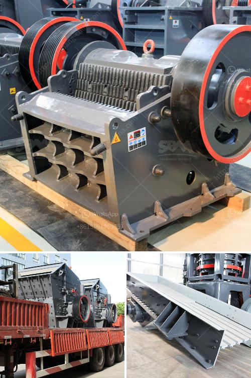

<h3>machinery required to setup cement plant</h3>
Setting up a cement plant involves a significant amount of machinery. The machinery required to set up a cement plant can be classified into two types: those required for the production process and those required for auxiliary operations. Let's explore the machinery required for each category.

In terms of production process, the primary machinery includes crushers, raw material mills, preheaters, kilns, clinker coolers, and cement mills. Crushers are used to crush limestone, marl, or other raw materials into smaller particles. Raw material mills grind and mix these materials to form a raw meal, which is then dried and heated in preheaters. Kilns are used to burn the raw meal at high temperatures, resulting in the formation of clinker. Clinker coolers cool the clinker down to a suitable temperature, while cement mills grind the clinker and additives to produce cement.

Auxiliary machinery required for cement production includes conveyor belts, bucket elevators, air slides, dust collectors, and cement silos. Conveyor belts transport raw materials and clinker between different stages of the production process. Bucket elevators lift and transfer materials vertically. Air slides assist in the transportation of powdered materials. Dust collectors are essential for capturing and controlling airborne particulates. Cement silos store the final product before it is dispatched for distribution.

Apart from the production process, cement plants may require additional machinery for auxiliary operations such as power generation and environmental control. Generators or turbines are needed to ensure a constant and reliable power supply. Environmental control systems, including dust control, waste management, and cooling systems, play a crucial role in maintaining compliance with environmental regulations.

In conclusion, setting up a cement plant involves a variety of machinery to carry out the production process and support auxiliary operations. The machinery required includes crushers, raw material mills, preheaters, kilns, clinker coolers, cement mills, conveyor belts, bucket elevators, air slides, dust collectors, cement silos, generators, and environmental control systems. Investing in high-quality machinery is crucial for the smooth and efficient operation of a cement plant.
<h3>Contact us</h3><ul><li><strong>Whatsapp:&nbsp;<a href="https://wa.me/8613661969651">+8613661969651</a></strong></li><li><a href="https://swt.shibang-china.com/?git&amp;zhl&amp;machinery required to setup cement plant"><strong>Online Service(chat now)</strong></a></li></ul><h3>Related</h3><ul><li><a href='wet wet grinding mills.md'>wet wet grinding mills</a></li><li><a href='impact crusher for sale in turkey.md'>impact crusher for sale in turkey</a></li><li><a href='quarry machines from germany.md'>quarry machines from germany</a></li><li><a href='quotation for minimum quary plant.md'>quotation for minimum quary plant</a></li><li><a href='china grove roller mill.md'>china grove roller mill</a></li></ul>