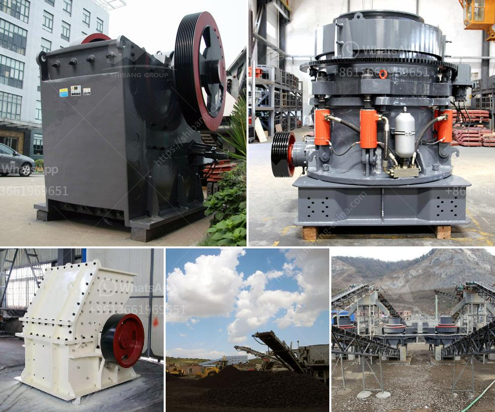

<h3>machinery to crush quartz</h3>
Quartz is a mineral that comes in a variety of colors and forms. It is one of the most abundant minerals on earth and has numerous industrial uses due to its hardness and resistance against chemicals. However, to utilize quartz effectively, it often needs to be crushed into smaller particles.

The process of crushing quartz into smaller pieces involves the use of powerful machinery. These machines are designed to break larger chunks of quartz into smaller, more manageable sizes. The machinery used varies depending on the level of crushing required, as well as the hardness and durability of the quartz material itself.

One commonly used machine for crushing quartz is the jaw crusher. It is often used as the primary crushing equipment and is used for a variety of stone materials including river pebbles, granite, basalt, quartz stone, etc. The jaw crusher has a large crushing force and high crushing efficiency. It directly crushes the quartz material in a compressive manner, avoiding the potential risk of over-crushing or damaging the machine.

In addition to jaw crushers, there are various other machinery options available for crushing quartz. For example, impact crushers provide high crushing efficiency by grinding the quartz against a solid surface. Cone crushers, on the other hand, utilize a spinning cone that gyrates against the mantle of the machine to crush the quartz into finer particles.

Crushing quartz is an important step in many industrial processes. These crushed quartz particles are often used in the composition of key materials for industries such as glass, ceramics, and chemicals. By breaking down quartz into smaller, more manageable sizes, it becomes easier to manipulate and use in various applications.

Moreover, crushing quartz offers environmental benefits. Crushing machines are designed to operate with minimal noise and dust emissions, ensuring a healthier and safer working environment. Additionally, the ability to crush quartz efficiently reduces the need for excessive energy consumption during subsequent processing stages.

In conclusion, machinery used to crush quartz plays a crucial role in various industries. These machines allow for the effective breaking down of quartz into smaller particles, making it more manageable and easier to utilize. The range of machinery available ensures that quartz can be crushed to different levels of fineness depending on the specific industrial application. Investing in quality machinery greatly contributes to the overall efficiency and sustainability of quartz crushing processes.
<h3>Contact us</h3><ul><li><strong>Whatsapp:&nbsp;<a href="https://wa.me/8613661969651">+8613661969651</a></strong></li><li><a href="https://swt.shibang-china.com/?git&amp;zhl&amp;machinery to crush quartz"><strong>Online Service(chat now)</strong></a></li></ul><h3>Related</h3><ul><li><a href='wet ground mica powder mill equipment supplier.md'>wet ground mica powder mill equipment supplier</a></li><li><a href='how to start gold mining in ghana.md'>how to start gold mining in ghana</a></li><li><a href='scale mining equipment for africa sudan market.md'>scale mining equipment for africa sudan market</a></li><li><a href='china clay processing plant.md'>china clay processing plant</a></li><li><a href='hammer mill dealer in cebu.md'>hammer mill dealer in cebu</a></li></ul>