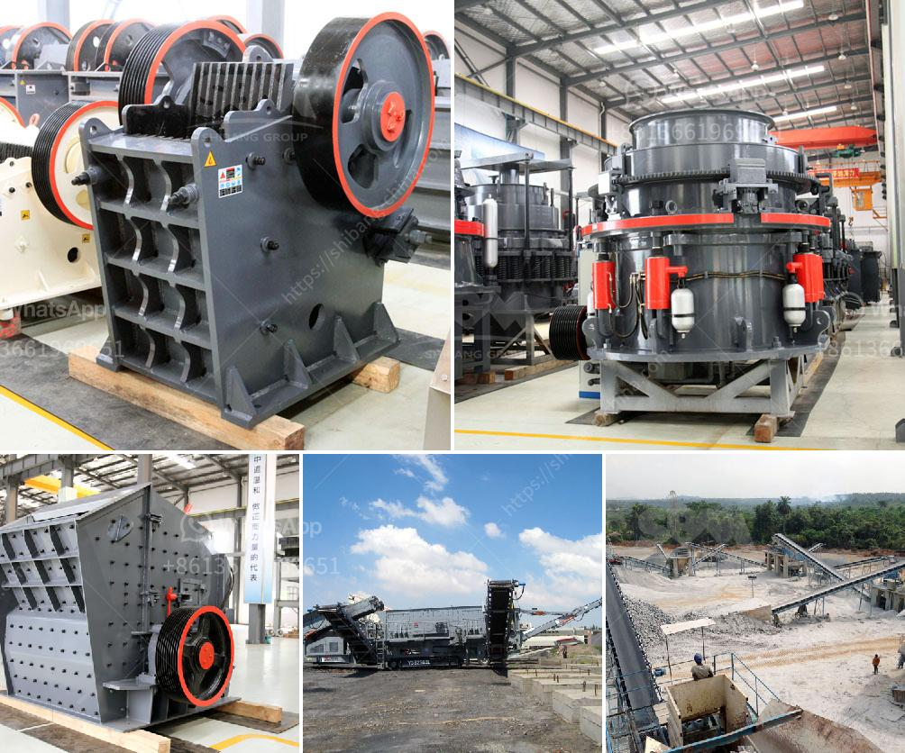

<h3>magnesite processing plant</h3>
A magnesite processing plant is a key facility in the production of magnesite, a mineral used in various applications such as fertilizers, animal feed, and environmental solutions. This article introduces the importance and highlights the key features of a magnesite processing plant.

One of the primary purposes of a magnesite processing plant is to extract magnesite ore from underground mines or open-pit operations. This raw material is then processed through various stages to obtain a commercial-grade product. The processing plant consists of multiple units, each designed to perform specific tasks.

Firstly, the raw magnesite ore undergoes crushing and grinding to reduce its size, facilitating further processing. This is typically followed by magnetic separation to remove unwanted impurities and separate the magnesite particles from other minerals.

Next, the magnesite concentrate is subjected to flotation to further enrich the magnesite content. Flotation is a widely used technique that exploits the difference in surface properties of different minerals. By adding specific reagents, the valuable magnesite particles are made to attach to air bubbles, which float to the surface for collection.

After flotation, the magnesite concentrate is further processed through thermal treatment, typically in a rotary kiln. This process is known as calcination and involves heating the magnesite to high temperatures to drive off carbon dioxide and convert it into a desired product known as caustic magnesia or magnesia powder.

Finally, the magnesia powder is milled and classified to produce different grades of magnesia products, catering to various industry requirements. These products may include dead-burned magnesia, fused magnesia, caustic calcined magnesia, and more.

In addition to these primary processing steps, a magnesite processing plant may also include auxiliary units for waste disposal, water treatment, and energy generation. These auxiliary units ensure the plant operates in an environmentally sustainable manner and efficiently utilizes available resources.

In conclusion, a magnesite processing plant is an integral part of the magnesite production cycle, transforming raw magnesite ore into valuable magnesia products. The plant utilizes various physical and chemical processes to extract, purify, and refine the magnesite concentrate. With its versatile applications, magnesite continues to play a crucial role in various industries, making the existence of a processing plant essential for meeting market demands.
<h3>Contact us</h3><ul><li><strong>Whatsapp:&nbsp;<a href="https://wa.me/8613661969651">+8613661969651</a></strong></li><li><a href="https://swt.shibang-china.com/?git&amp;zhl&amp;magnesite processing plant"><strong>Online Service(chat now)</strong></a></li></ul><h3>Related</h3><ul><li><a href='bauxite mining process.md'>bauxite mining process</a></li><li><a href='jual stone crusher mobile cap 30 tph in indonesia.md'>jual stone crusher mobile cap 30 tph in indonesia</a></li><li><a href='ball mill manufacturers coimbatore.md'>ball mill manufacturers coimbatore</a></li><li><a href='ball mills in autocad.md'>ball mills in autocad</a></li><li><a href='50 tph stone crusher plant price.md'>50 tph stone crusher plant price</a></li></ul>