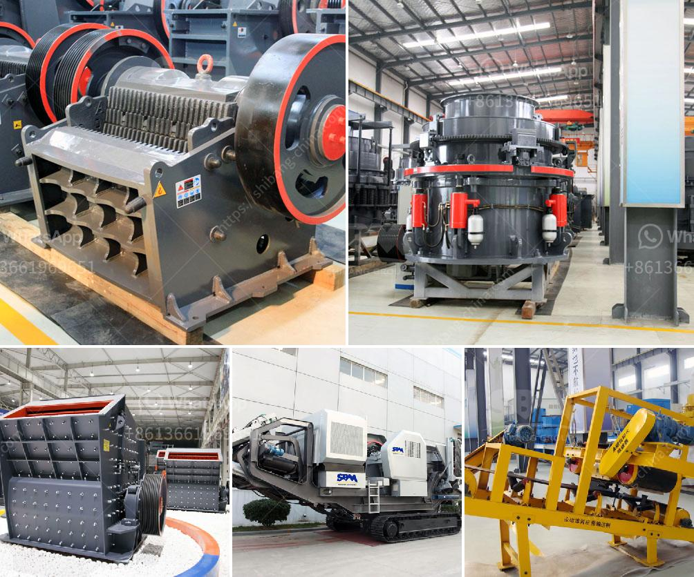

<h3>magnetic iron ore processing plant cost</h3>
Magnetic iron ore processing plants are becoming more popular due to the environmental benefits and cost savings that they provide. In addition to supplying valuable iron ore fines, these plants also produce a byproduct known as magnetite tailings which are used for various purposes in industries like construction, agriculture, and manufacturing. However, setting up a magnetic iron ore processing plant can be a significant investment. In this article, we will explore the factors that affect the cost of establishing such a plant.

One of the primary considerations in determining the cost of a magnetic iron ore processing plant is the location of the mine site. Transportation costs can add up quickly, especially if the mine is located in a remote area. The distance from the mine to the processing plant can result in higher expenses for fuel, equipment maintenance, and labor. Generally, a closer proximity between the mine and the plant will result in lower transportation costs, making it a crucial factor to consider when selecting a site.

Another cost factor to consider is the size of the processing plant. The scale of operations directly affects the capital investment required. A larger plant with a higher processing capacity will require more machinery, infrastructure, and labor, thus increasing the overall cost. On the other hand, a smaller plant may have lower upfront costs but may not be as efficient in processing the iron ore, resulting in lower output and potential financial losses in the long term. Striking a balance between cost and efficiency is essential.

The choice of technology and equipment is also crucial in determining the cost of a magnetic iron ore processing plant. Advanced technologies that require less energy and fewer consumables may have a higher initial investment cost but can lead to substantial savings in the long run. It is important to select equipment that maximizes the recovery rate of iron ore fines while minimizing energy consumption and environmental impact. Investing in high-quality equipment from reputable suppliers is essential for efficient and cost-effective operations.

Labor costs play a significant role in the overall cost of operating a magnetic iron ore processing plant. Skilled labor is required for various tasks, including mine operation, ore processing, maintenance, and quality control. Higher labor costs, including wages and benefits, can significantly impact the profitability of the plant. Automation and mechanization can help reduce labor requirements, but investing in training and development programs for the workforce can also optimize productivity and reduce costs in the long term.

In conclusion, setting up a magnetic iron ore processing plant comes with various costs that need to be carefully considered. Factors such as site location, plant size, technology, equipment, and labor costs all play crucial roles. Investing in a well-designed and efficiently operated plant can lead to long-term cost savings, increased production capacity, and environmental benefits. It is important to work with experienced professionals and suppliers to ensure that the plant is cost-effective and meets the desired objectives.
<h3>Contact us</h3><ul><li><strong>Whatsapp:&nbsp;<a href="https://wa.me/8613661969651">+8613661969651</a></strong></li><li><a href="https://swt.shibang-china.com/?git&amp;zhl&amp;magnetic iron ore processing plant cost"><strong>Online Service(chat now)</strong></a></li></ul><h3>Related</h3><ul><li><a href='used stone crusher plant for sale in china.md'>used stone crusher plant for sale in china</a></li><li><a href='quartz crushers price in india.md'>quartz crushers price in india</a></li><li><a href='vertical shaft impact crushers.md'>vertical shaft impact crushers</a></li><li><a href='hammer crusher china.md'>hammer crusher china</a></li><li><a href='grinding ball mills type p500.md'>grinding ball mills type p500</a></li></ul>