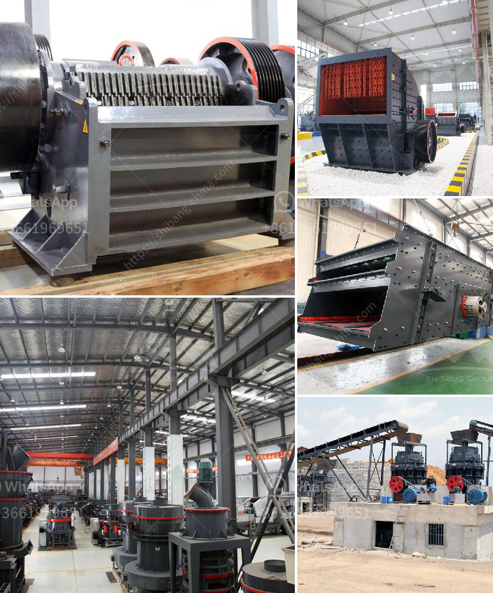

<h3>magnetic separator equipment for sale</h3>
Magnetic separation is a method used to separate magnetic materials from non-magnetic ones. It utilizes the power of magnets to attract and remove ferrous contaminants in various industries, ensuring product purity and equipment protection. Magnetic separator equipment for sale is widely available, catering to different applications and industries such as mining, recycling, chemical, food, and more.

One of the most common uses for magnetic separators is in the mining industry. Magnetic separators are crucial for removing tramp iron and tramp metal from raw materials for further processing. This ensures the prevention of damage to crushers, conveyor belts, and other downstream equipment, as well as maintaining product quality. Magnetic separator equipment for sale in the mining industry includes magnetic drum separators, magnetic bullet separators, plate magnets, and magnetic pulleys, among others.

In the recycling industry, magnetic separators play a vital role in separating and recovering valuable materials from waste streams. They are used to remove metals like steel and aluminum from shredded recycling materials. This allows for the reuse of metals, reducing the need for mining and conserving valuable resources. Magnetic separators for sale in the recycling industry include eddy current separators, magnetic drum separators, overband magnetic separators, and magnetic grids.

Chemical and pharmaceutical industries also benefit greatly from magnetic separators. These industries rely on precise and pure products, making the removal of magnetic contaminants essential. Magnetic separators remove metallic impurities from raw materials and final products, ensuring the quality and purity of chemicals and pharmaceuticals. Equipment available for sale in these industries includes magnetic grids, magnetic tubes, and magnetic filters.

In the food and beverage industry, magnetic separators are used to ensure food safety and prevent damage to processing equipment. They remove magnetic and non-magnetic contaminants from food products, including metal fragments and particles. Magnetic traps, grate magnets, and magnetic filters are commonly used magnetic separators in this industry.

The efficiency and effectiveness of magnetic separators depend on various factors such as magnetic strength, design, and operating conditions. Manufacturers offer a wide range of magnetic separator equipment for sale to cater to different applications and industry requirements. These include permanent and electromagnetic separators, wet and dry separators, magnetic drums, magnetic pulleys, magnetic grids, and more.

When considering the purchase of magnetic separator equipment, it is important to evaluate the specific needs of your industry, the volume of materials to be processed, the level of magnetic separation required, and other relevant factors. Working closely with magnetic separator experts or consulting professional companies can help guide you in choosing the appropriate equipment for your application.

In conclusion, magnetic separator equipment for sale offers numerous advantages across various industries. They improve product purity, protect downstream equipment, and optimize processes. Investing in reliable, high-quality magnetic separators can enhance productivity, reduce maintenance costs, and provide efficient and consistent results. With a wide range of options available, it is essential to choose magnetic separators that meet your specific needs and deliver optimal performance.
<h3>Contact us</h3><ul><li><strong>Whatsapp:&nbsp;<a href="https://wa.me/8613661969651">+8613661969651</a></strong></li><li><a href="https://swt.shibang-china.com/?git&amp;zhl&amp;magnetic separator equipment for sale"><strong>Online Service(chat now)</strong></a></li></ul><h3>Related</h3><ul><li><a href='company profile for suppliers of mining equipment.md'>company profile for suppliers of mining equipment</a></li><li><a href='manufacturer of clinker grinding machine.md'>manufacturer of clinker grinding machine</a></li><li><a href='mobile crushers for sale in nigeria.md'>mobile crushers for sale in nigeria</a></li><li><a href='cost of quarry crusher machines.md'>cost of quarry crusher machines</a></li><li><a href='industrial conveyor belts dimensions.md'>industrial conveyor belts dimensions</a></li></ul>