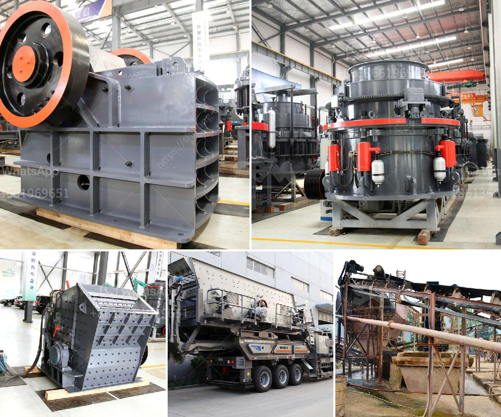

<h3>maintenance of raymond mill</h3>
Raymond mill is a common grinding equipment for powder processing in various industries. It is suitable for processing non-flammable and non-explosive materials with Mohs hardness below 9.3 and humidity below 6%. However, as a common grinding equipment, Raymond mill will appear some problems during its operation. In order to guarantee the normal operation of Raymond mill, it is necessary to maintain it regularly. This article will introduce the maintenance of Raymond mill in detail.

Firstly, it is necessary to check the lubrication system of Raymond mill regularly. The lubrication system plays a vital role in the operation of Raymond mill. If the lubrication system is not well-maintained, the parts of Raymond mill will be easily worn out and the service life of Raymond mill will be shortened. Therefore, it is necessary to add lubricating oil to the lubrication points of Raymond mill regularly according to the operation manual. In addition, the host bearing of Raymond mill should be lubricated regularly to ensure the smooth operation of the bearing.

Secondly, the grinding roller and grinding ring of Raymond mill should be checked regularly. The grinding roller and grinding ring are the main grinding parts of Raymond mill. The grinding roller and grinding ring should be replaced and repaired in time if they are found to be seriously worn or damaged. The replacement cycle of the grinding roller and grinding ring should be determined according to the specific production conditions. In addition, the wear degree of the grinding roller and grinding ring should be checked regularly to avoid affecting the grinding effect of Raymond mill.

Furthermore, the air volume and air pressure of Raymond mill should be adjusted properly. The air volume and air pressure are closely related to the fineness and output of Raymond mill. Different materials require different air volume and air pressure to ensure the fineness and output of the final products. Therefore, it is necessary to adjust the air volume and air pressure of Raymond mill in time according to the specific production conditions.

Finally, the Raymond mill should be inspected comprehensively after a period of operation. The inspection includes the tightness of screws, the wear degree of wearing parts, the presence of abnormal noise, etc. If any problem is found, it should be repaired or replaced immediately. In addition, the electrical system of Raymond mill should also be checked regularly to ensure its safety in operation.

In conclusion, the timely and regular maintenance of Raymond mill is essential to ensure its normal operation and prolong its service life. The maintenance of Raymond mill includes checking the lubrication system, inspecting the grinding roller and grinding ring, adjusting the air volume and air pressure, and comprehensive inspection of Raymond mill after a period of operation. As long as the maintenance work of Raymond mill is done well, its performance and efficiency will be guaranteed, and it will create excellent economic benefits for the users.
<h3>Contact us</h3><ul><li><strong>Whatsapp:&nbsp;<a href="https://wa.me/8613661969651">+8613661969651</a></strong></li><li><a href="https://swt.shibang-china.com/?git&amp;zhl&amp;maintenance of raymond mill"><strong>Online Service(chat now)</strong></a></li></ul><h3>Related</h3><ul><li><a href='jaw crushers kyrgyzstan.md'>jaw crushers kyrgyzstan</a></li><li><a href='rock crusher screen.md'>rock crusher screen</a></li><li><a href='china coal crusher high capacity.md'>china coal crusher high capacity</a></li><li><a href='portable sand washing machine.md'>portable sand washing machine</a></li><li><a href='mining characteristics of crusher.md'>mining characteristics of crusher</a></li></ul>