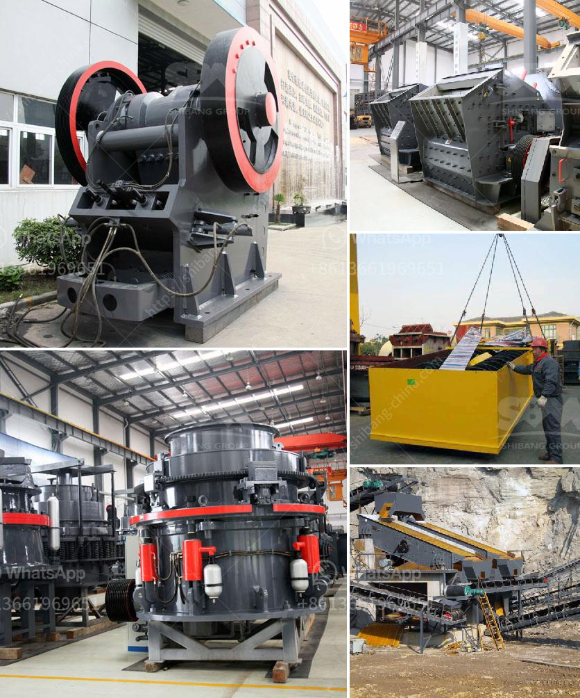

<h3>malaysia conveyor belts</h3>
Conveyor belts are an essential component of various industries, including manufacturing, mining, food processing, and logistics. In Malaysia, conveyor belt systems play a crucial role in enhancing the efficiency and productivity of these industries. With advanced technology and continuous innovation, Malaysian conveyor belts are highly regarded for their durability, versatility, and ease of operation.

One of the primary advantages of Malaysian conveyor belts is their ability to move a wide range of materials, including heavy and bulk items. These belts are designed to handle different types of products, such as grains, coal, ore, boxes, and even hot materials. Their versatility allows businesses to streamline their processes, reduce manual labor, and improve overall productivity.

In addition to their versatility, conveyor belts in Malaysia are known for their durability and reliability. The belts are made from high-quality materials, such as rubber, nylon, or steel, which can withstand heavy loads and harsh environments. Malaysian conveyor belt manufacturers also ensure strict quality control measures during the production process, resulting in robust belts that have a long service life and require minimal maintenance.

Another noteworthy feature of Malaysian conveyor belts is their advanced automation capabilities. With the integration of sensors, motors, and software, these belts can be programmed to perform various tasks automatically, such as sorting, weighing, and packaging. This automation significantly reduces the need for human intervention, minimizing the risk of errors and enhancing operational efficiency.

Furthermore, Malaysian conveyor belts are well-designed to meet industry-specific requirements. Different industries have unique needs when it comes to conveyor systems, such as temperature control, cleanroom compatibility, or resistance to chemicals. Malaysian manufacturers cater to these specialized requirements, offering customized conveyor belt solutions that align with industry standards and regulations.

Environmental sustainability is also a key consideration for Malaysian conveyor belt manufacturers. With the increasing focus on green practices, these manufacturers strive to develop eco-friendly belts that minimize energy consumption and reduce carbon footprint. This commitment to sustainability aligns with the global efforts towards a greener and more sustainable future.

Additionally, the conveyor belt industry in Malaysia is supported by a robust network of suppliers, distributors, and service providers. These stakeholders collaborate to provide comprehensive solutions, including installation, maintenance, troubleshooting, and spare parts support. This network ensures that businesses have access to reliable after-sales services, minimizing downtime and maximizing operational continuity.

In conclusion, Malaysian conveyor belts offer a wide range of benefits to various industries. Their versatility, durability, automation capabilities, and industry-specific designs make them indispensable in improving efficiency, productivity, and sustainability. As Malaysia continues to advance technologically, the conveyor belt industry plays a vital role in supporting the growth and competitiveness of the country's industries.
<h3>Contact us</h3><ul><li><strong>Whatsapp:&nbsp;<a href="https://wa.me/8613661969651">+8613661969651</a></strong></li><li><a href="https://swt.shibang-china.com/?git&amp;zhl&amp;malaysia conveyor belts"><strong>Online Service(chat now)</strong></a></li></ul><h3>Related</h3><ul><li><a href='high reversible mill with 750 mm diameter rolls.md'>high reversible mill with 750 mm diameter rolls</a></li><li><a href='rock crushing price.md'>rock crushing price</a></li><li><a href='raymond mill coal pulverizer.md'>raymond mill coal pulverizer</a></li><li><a href='vibro screen machine in ahmedabad.md'>vibro screen machine in ahmedabad</a></li><li><a href='mining process of marble crusher.md'>mining process of marble crusher</a></li></ul>