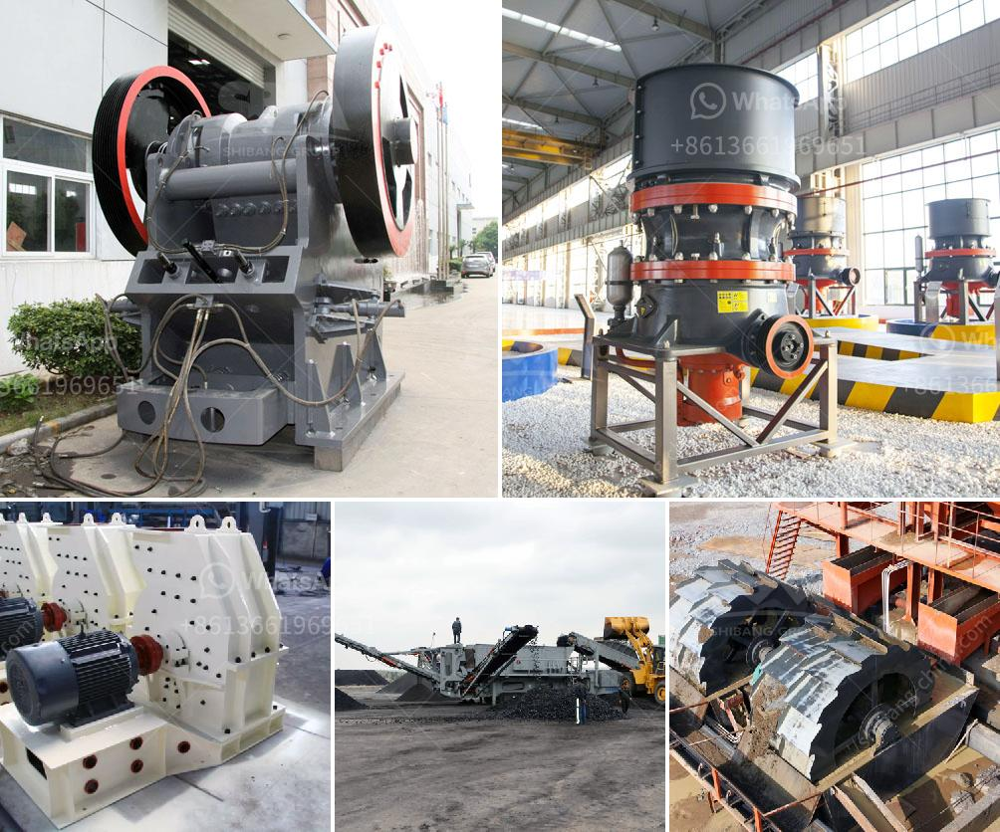

<h3>malaysia raymond mill</h3>
Malaysia is a Southeast Asian country with abundant natural resources that is highly reliant on agriculture and manufacturing sectors for its economic growth. With the rising demand for finely ground materials in various industries, the need for efficient and reliable grinding equipment has become increasingly important. This is where the Raymond mill, a high-end grinding mill, comes into the picture.

Raymond mill, also known as Raymond roller mill, has been around for more than a century and continues to evolve and improve to meet the demands of the modern industry. It is a versatile grinding mill that uses centrifugal force to grind materials into fine powders. The mill consists of a rotating shaft with several grinding rollers suspended on it, and a stationary grinding ring. As the shaft rotates, the rollers press against the ring, grinding the material between them.

One of the key advantages of the Raymond mill is its ability to produce uniform and fine particles. The mill can grind a wide range of materials, including barite, calcite, dolomite, limestone, marble, talc, gypsum, and more. This versatility allows it to be used in various industries such as mining, construction, chemical, metallurgy, and ceramics.

Efficiency is another area where the Raymond mill excels. The grinding rollers and grinding ring are made of special wear-resistant materials that can withstand high pressures and ensure a longer service life. The design of the mill is also optimized to minimize energy consumption while maximizing the grinding capacity. This results in substantial cost savings and improved productivity for businesses.

In addition to its efficiency, the Raymond mill is also known for its low maintenance requirements. The mill is designed to be user-friendly with easy access to all its components, making maintenance and repair tasks simple and quick. This is particularly beneficial for businesses in Malaysia where downtime can be costly.

Moreover, the Raymond mill offers excellent control over the size and distribution of the final product. The mill is equipped with a high-precision classifier that ensures the desired particle size is achieved consistently. This is crucial for industries such as ceramics, where precise particle size is critical for the final product quality.

Another significant advantage of the Raymond mill is its ability to handle both dry and wet materials. This versatility makes it suitable for a wide range of applications and allows businesses to adapt to changing materials and process requirements.

In conclusion, the Raymond mill is a high-end grinding equipment that offers excellent efficiency, low maintenance, and exceptional control over the final product quality. Its versatility and reliability make it an ideal choice for businesses in Malaysia that require finely ground materials for their operations. With its ability to handle various materials and its optimized design, the Raymond mill can significantly boost efficiency and productivity, ultimately contributing to the economic growth of the country.
<h3>Contact us</h3><ul><li><strong>Whatsapp:&nbsp;<a href="https://wa.me/8613661969651">+8613661969651</a></strong></li><li><a href="https://swt.shibang-china.com/?git&amp;zhl&amp;malaysia raymond mill"><strong>Online Service(chat now)</strong></a></li></ul><h3>Related</h3><ul><li><a href='aggregate machinery.md'>aggregate machinery</a></li><li><a href='models and prices of vibrating screens.md'>models and prices of vibrating screens</a></li><li><a href='grinding machine for bentonite.md'>grinding machine for bentonite</a></li><li><a href='impact crusher suppliers italy.md'>impact crusher suppliers italy</a></li><li><a href='prices by hammer mills.md'>prices by hammer mills</a></li></ul>