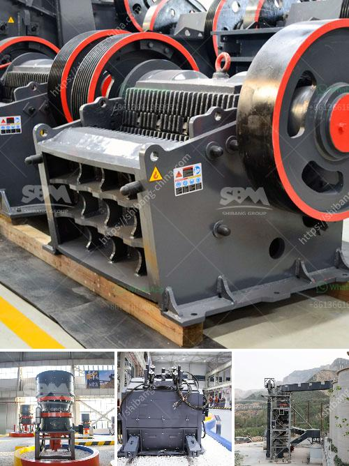

<h3>manganese ore concentrate south africa</h3>
Manganese is an essential chemical element used in various industrial applications, including steel production, batteries, and fertilizers. South Africa, one of the world's leading mining countries, has significant deposits of manganese ore. These deposits, located primarily in the Kalahari Manganese Field, make South Africa a major player in the global manganese market.

South Africa's manganese ore deposits are known for containing high-grade ore, making them particularly lucrative for mining companies. The country's vast resources and well-established infrastructure contribute to its position as a key manganese producer. One of the most sought-after products in this industry is manganese ore concentrate.

Manganese ore concentrate is a high-quality product obtained during the process of extracting manganese from the ore. It comprises predominantly pure manganese oxide, typically in the form of pyrolusite (MnO2), which is further processed into various grades for different applications. The ore concentrate's purity and quality make it an essential raw material, especially in the steel industry.

Steel production is the largest consumer of manganese ore concentrate. Manganese is a crucial alloying element in steel, enhancing its strength and durability. In stainless steel, it improves resistance to corrosion and wear. This versatile metal is also used in the production of cast iron, fuel cells, and other industrial applications. The valuable properties of manganese make its ore concentrate a treasured commodity worldwide.

South Africa is a significant exporter of manganese ore concentrate, supplying the global market with millions of tons annually. The country's high-quality product is highly regarded by international buyers in countries such as China, India, and Japan, which rely heavily on this resource for their steel production.

The extraction and production of manganese ore concentrate generate numerous economic benefits for South Africa. The mining industry contributes significantly to the country's GDP and provides employment opportunities for thousands of local workers, boosting economic growth and development. The revenue generated from manganese exports further supports the country's economy.

However, the extraction of manganese ore concentrate is not without its environmental challenges. The process of mining and processing this valuable resource can have adverse impacts on ecosystems if not managed properly. Therefore, it is crucial for mining companies to adopt sustainable practices that minimize environmental degradation and promote responsible mining.

Moreover, promoting local beneficiation of manganese ore concentrate is essential to maximize the economic benefits for South Africa. Beneficiation involves adding value to the raw ore through various processes to improve its quality and purity. This approach provides opportunities for downstream industries to develop and diversify, creating a more sustainable and inclusive economy.

In conclusion, manganese ore concentrate in South Africa plays a vital role in the global manganese market, particularly in the steel industry. The country's significant reserves and high-grade deposits position it as a leading exporter of this valuable resource. However, it is crucial to prioritize sustainable mining practices and promote local beneficiation to ensure long-term economic prosperity while protecting the environment.
<h3>Contact us</h3><ul><li><strong>Whatsapp:&nbsp;<a href="https://wa.me/8613661969651">+8613661969651</a></strong></li><li><a href="https://swt.shibang-china.com/?git&amp;zhl&amp;manganese ore concentrate south africa"><strong>Online Service(chat now)</strong></a></li></ul><h3>Related</h3><ul><li><a href='manganese ore concentrate south africa.md'>manganese ore concentrate south africa</a></li><li><a href='advantages and disadvantages of a roll crusher.md'>advantages and disadvantages of a roll crusher</a></li><li><a href='ball mill procedure in practical.md'>ball mill procedure in practical</a></li><li><a href='i want to buy a quarry machine nigeria.md'>i want to buy a quarry machine nigeria</a></li><li><a href='differences between hammer mill and ball mill.md'>differences between hammer mill and ball mill</a></li></ul>