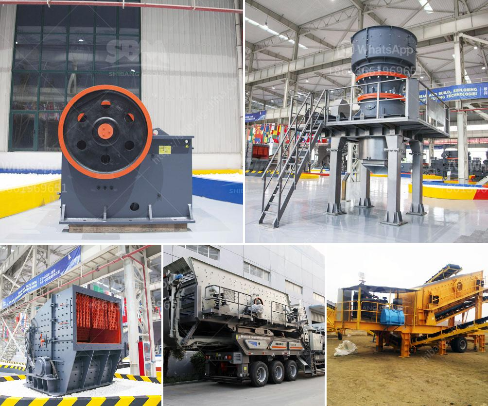

<h3>manufacturer jaw crusher</h3>
Jaw crushers are widely used in mining, metallurgy, construction, highway, railway, irrigation and chemical industries, and our jaw crushers have the features of high reduction ratio, even powder sizes, low power consumption, and easy maintenance. The crushing strength of the jaw crusher materials is up to 350 MPa.

Manufacturer jaw crusher machines are typically characterized by their crushing capacity and working efficiency. The advanced jaw crushers are equipped with hydraulic systems, which significantly reduce downtime and maintain efficient operations. This feature ensures maximum production rates and higher profitability.

Manufacturer jaw crushers incorporate a number of patented innovations that provide advanced performance and reliability at an affordable price. These machines are designed to exceed customer expectations in terms of crushing performance, machine reliability, and durability.

With a long history of providing reliable and innovative solutions, Manufacturer jaw crushers are known for their exceptional engineering skills and high quality manufacturing standards. They offer a wide range of models to choose from, catering to different needs and applications.

One of the key design features of Manufacturer jaw crushers is their versatility. They can handle a wide range of materials, including hard and abrasive stones, and are ideal for primary crushing. The adjustable jaw plate allows for easy adjustment of the size of the crushed material.

In conclusion, Manufacturer jaw crushers are the perfect choice for crushing applications. Their superior performance, reliability, and innovation make them a popular choice among customers. Whether it's in mining, construction, or any other industry, Manufacturer jaw crushers deliver on both performance and efficiency. So if you are in need of a jaw crusher, look no further than Manufacturer for a reliable and high-quality solution.
<h3>Contact us</h3><ul><li><strong>Whatsapp:&nbsp;<a href="https://wa.me/8613661969651">+8613661969651</a></strong></li><li><a href="https://swt.shibang-china.com/?git&amp;zhl&amp;manufacturer jaw crusher"><strong>Online Service(chat now)</strong></a></li></ul><h3>Related</h3><ul><li><a href='cone crushers to rent south africa.md'>cone crushers to rent south africa</a></li><li><a href='spare parts for a jaw crusher.md'>spare parts for a jaw crusher</a></li><li><a href='small rock crusher machine for sale.md'>small rock crusher machine for sale</a></li><li><a href='features a hammer mill.md'>features a hammer mill</a></li><li><a href='stone crusher bahan bakar.md'>stone crusher bahan bakar</a></li></ul>