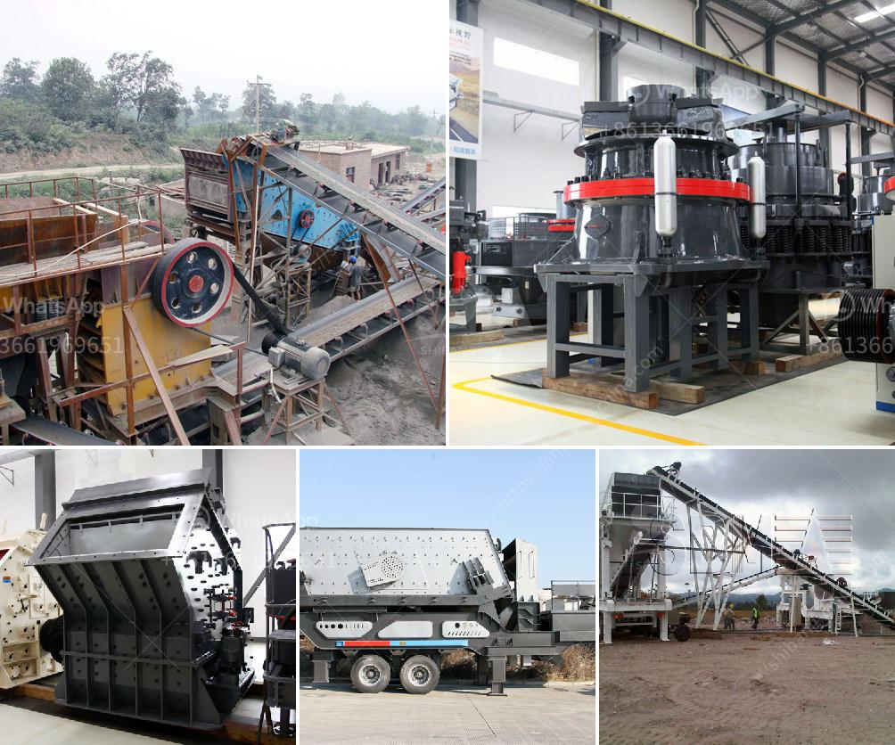

<h3>manufacturer of ball mill india</h3>
The ball mill is a key piece of equipment for grinding crushed materials, and it is widely used in production lines for powders such as cement, silicates, refractory material, fertilizer, glass ceramics, etc. As well as for ore dressing of both ferrous non-ferrous metals. The ball mill can grind various ores and other materials either wet or dry.

There are two kinds of ball mills, grate type and overfall type, due to different ways of discharging material. There are many types of grinding media suitable for use in a ball mill, including ceramic balls, flint pebbles, and stainless steel balls. Please contact manufacturer of ball mill India, Shanghai Clirik Machinery Co., Ltd if you are interested in ball mill.

Shanghai Clirik Machinery Co., Ltd is a large professional manufacturer of ball mill in China, specializing in the development and manufacture of a wide variety of ball mills, including dry ball mills, wet ball mills, gold ball mills, cement ball mills, etc. With over 20 years of experience in ball mill manufacturing, Clirik has achieved great success in the industry.

Clirik ball mills have been used to grind glass, powder food products, create custom varnishes, make ceramic glaze, powder various chemicals, and make black powder. They are also used to conduct experiments in laboratories and industries.

Clirik ball mill India is characterized by its simple structure, easy operation, low maintenance cost, high efficiency, and energy saving. The hollow shaft is made of cast steel, the lining can be changed, and the rotary gear is made of a hobbing process. The shell is made of wear-resistant material, which has good wear resistance, impact resistance, and high-temperature resistance.

Clirik ball mill India has advanced technology and quality. With years of experience in ball mill manufacturing, Clirik has developed a series of ball mills with high cost performance and excellent quality to meet the needs of customers.

Clirik ball mill India is widely used in various industries, such as cement, silicate products, new building materials, refractory materials, fertilizers, ferrous and non-ferrous metals beneficiation, and glass ceramics. Clirik ball mills are exported to more than 30 countries and regions in the world, including India, South Africa, Russia, Indonesia, Brazil, Peru, and other countries.

In conclusion, as a professional manufacturer of ball mill India, Clirik Machinery Co., Ltd not only provides high-quality and efficient ball mills but also provides comprehensive pre-sales and after-sales services to ensure each customer's satisfaction. If you want to know more about Clirik ball mill India, please feel free to contact us.
<h3>Contact us</h3><ul><li><strong>Whatsapp:&nbsp;<a href="https://wa.me/8613661969651">+8613661969651</a></strong></li><li><a href="https://swt.shibang-china.com/?git&amp;zhl&amp;manufacturer of ball mill india"><strong>Online Service(chat now)</strong></a></li></ul><h3>Related</h3><ul><li><a href='gold milling licence in zimbabwe.md'>gold milling licence in zimbabwe</a></li><li><a href='malaysia conveyor belts.md'>malaysia conveyor belts</a></li><li><a href='cost o gypsum processing machines.md'>cost o gypsum processing machines</a></li><li><a href='aggregate crusher plant price.md'>aggregate crusher plant price</a></li><li><a href='vertical mill cement.md'>vertical mill cement</a></li></ul>