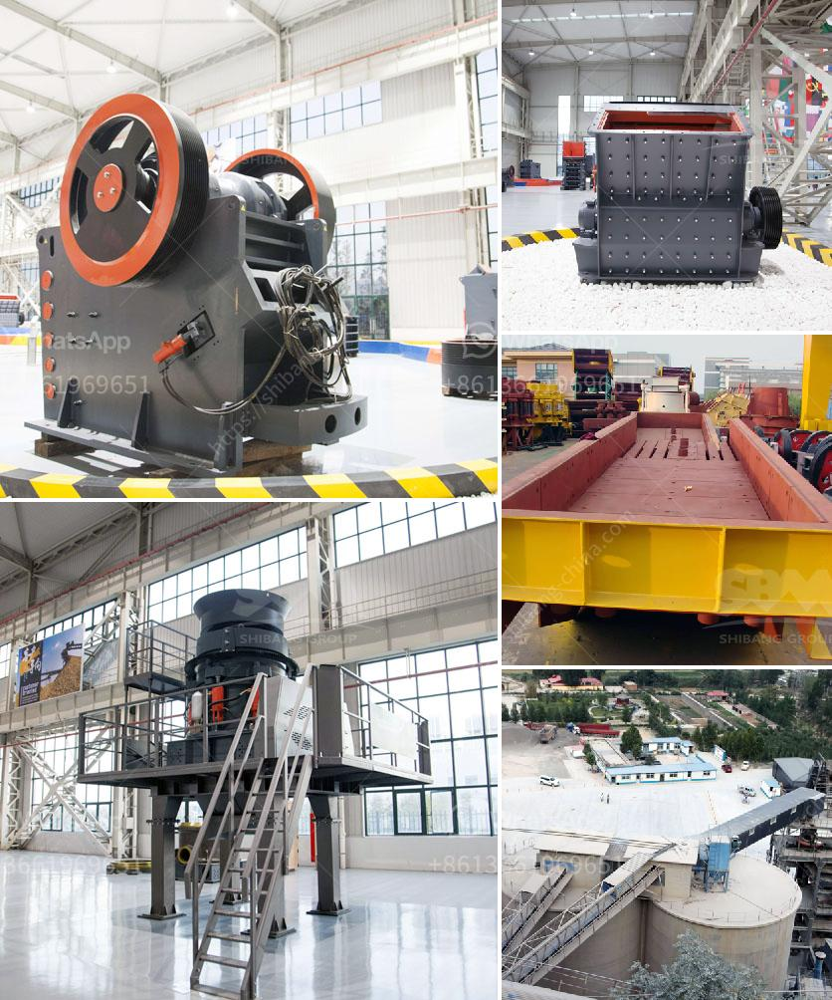

<h3>manufacturer of clinker grinding machine</h3>
The process of clinker grinding is the final phase in the production of cement. It involves grinding solid clinker particles down to a fine powder in order to blend them with other additives to produce cement. There are several types of clinker grinding machines available in the market today.

One of the most common types of clinker grinding machine is the ball mill. This machine is usually used in the final stage of grinding clinker before vertical roller mills, which are suitable for large industrial plants. Another common type of clinker grinding machine is the roller press. This machine combines the benefits of a ball mill and a roller mill, allowing for simultaneous grinding and drying.

When looking for a manufacturer of clinker grinding machines, it is important to consider several factors. Firstly, the manufacturer should have a reputation for producing high-quality machines that are durable and reliable. This can be determined by looking at customer reviews and testimonials.

Secondly, the manufacturer should have experience in the cement industry and understand the specific requirements of clinker grinding. This includes knowledge of the different types of clinker grinding machines and the ability to provide customized solutions according to the needs of the customer.

Thirdly, the manufacturer should offer after-sales support and maintenance services. Clinker grinding machines require regular maintenance to ensure optimal performance and longevity. A manufacturer that provides comprehensive after-sales support will help customers avoid any downtime and costly repairs.

Finally, the manufacturer should have a competitive pricing structure. While quality and service are essential, customers also need to consider the cost-effectiveness of the clinker grinding machine. Comparing prices from different manufacturers and analyzing the overall value provided is crucial.

In conclusion, finding a reliable manufacturer of clinker grinding machines is essential for cement producers. By considering factors such as reputation, experience, after-sales support, and pricing, customers can make an informed decision and choose the best machine for their requirements.
<h3>Contact us</h3><ul><li><strong>Whatsapp:&nbsp;<a href="https://wa.me/8613661969651">+8613661969651</a></strong></li><li><a href="https://swt.shibang-china.com/?git&amp;zhl&amp;manufacturer of clinker grinding machine"><strong>Online Service(chat now)</strong></a></li></ul><h3>Related</h3><ul><li><a href='stone crusher for road construction.md'>stone crusher for road construction</a></li><li><a href='overland conveyor belt system cost estimates.md'>overland conveyor belt system cost estimates</a></li><li><a href='sample of project proposal in mining.md'>sample of project proposal in mining</a></li><li><a href='mobile cone crusher.md'>mobile cone crusher</a></li><li><a href='coal wash plants for sale in malaysia.md'>coal wash plants for sale in malaysia</a></li></ul>