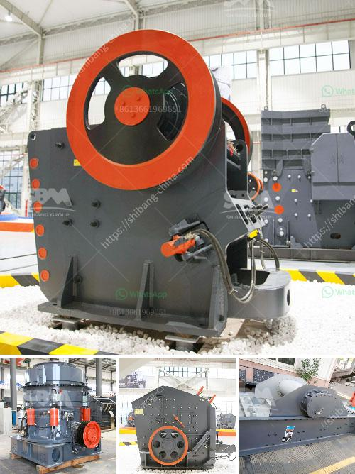

<h3>manufacturer of coal processing equipment</h3>
Coal has long been used as a reliable source of energy for various industries. As the world's largest producer of coal, China coal production accounted for over 46% of global coal production in 2019 (Statista). However, the world's dependency on coal is not without its challenges. The mining, processing, and burning of coal contribute significantly to greenhouse gas emissions and environmental pollution. This is where the importance of coal processing equipment comes into play.

A manufacturer of coal processing equipment specializes in providing high-quality equipment to efficiently and effectively process coal to meet the needs of different industries. The coal industry relies heavily on these specialized types of equipment. Coal processing equipment is widely used in the coal industry due to its robustness and versatility. In fact, it is an essential part of coal mining and processing.

Coal processing equipment made by a manufacturer plays a crucial role in the processing cycle of coal. By equipping coal processing equipment, the user can gain several benefits such as improved efficiency, lower operational costs, and reduced environmental impact.

Efficiency is a key factor in coal processing equipment. Manufacturers strive to develop equipment that maximizes the efficiency of coal processing, reducing the need for manual labor and improving output. Modern coal processing equipment is designed to handle large volumes of coal efficiently, reducing the time and effort required in processing. This can lead to increased productivity for coal mining companies, allowing them to meet the ever-growing demand for coal.

Furthermore, a manufacturer of coal processing equipment focuses on developing equipment that is more energy-efficient. Energy consumption is an important consideration for the coal industry as it directly impacts operational costs. Energy-efficient equipment can significantly reduce energy consumption, leading to cost savings for coal mining companies and reduced environmental impact.

Speaking of environmental impact, manufacturers of coal processing equipment are also committed to developing equipment that minimizes the negative impact on the environment. Coal processing equipment is designed to capture and control emissions, minimizing air pollution, and reducing the release of harmful greenhouse gases into the atmosphere. This is crucial in addressing climate change and reducing the carbon footprint of the coal industry.

Moreover, coal processing equipment manufacturers are continuously exploring new technologies and innovations to further enhance the efficiency and environmental sustainability of their equipment. They invest in research and development to improve coal processing technologies, making them more efficient, cleaner, and safer.

In conclusion, a manufacturer of coal processing equipment plays a vital role in the coal industry, providing efficient and sustainable equipment to meet the growing demand for coal. With a focus on efficiency and environmental sustainability, these manufacturers contribute to the overall development of the coal industry by improving productivity, reducing operational costs, and minimizing environmental impact. As the world continues to rely on coal as a source of energy, the importance of high-quality coal processing equipment cannot be underestimated.
<h3>Contact us</h3><ul><li><strong>Whatsapp:&nbsp;<a href="https://wa.me/8613661969651">+8613661969651</a></strong></li><li><a href="https://swt.shibang-china.com/?git&amp;zhl&amp;manufacturer of coal processing equipment"><strong>Online Service(chat now)</strong></a></li></ul><h3>Related</h3><ul><li><a href='quarry stone crushing machine manufacturers.md'>quarry stone crushing machine manufacturers</a></li><li><a href='dolomite crusher machine plant.md'>dolomite crusher machine plant</a></li><li><a href='latest three roll mills.md'>latest three roll mills</a></li><li><a href='how to process quartz ore crusher.md'>how to process quartz ore crusher</a></li><li><a href='mill crusher pigment manufacturer in kenya.md'>mill crusher pigment manufacturer in kenya</a></li></ul>