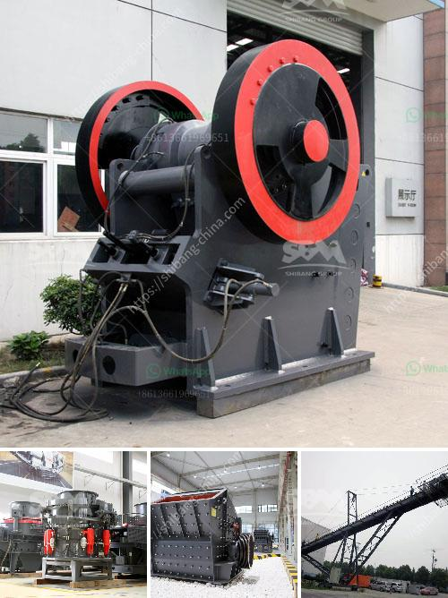

<h3>manufacturer of crushing equipment philippines</h3>
The Philippines, known for its rich natural resources, has been a favorable destination for various industries. One such industry that has thrived in the country is the manufacturing of crushing equipment. With demand for construction and infrastructure projects on the rise, manufacturers of crushing equipment are playing a crucial role in meeting these demands.

Crushing equipment refers to machinery used to crush larger stones into smaller pieces, gravel, or rock dust for various construction and industrial purposes. It is designed to break down materials such as granite, limestone, and concrete into smaller pieces for easier transport and disposal. This machinery is essential in the construction industry as it enables the production of aggregates used in the construction of buildings, roads, bridges, and other infrastructure projects.

The manufacturers of crushing equipment in the Philippines have been at the forefront of delivering high-quality machines that have revolutionized the construction industry. These manufacturers have invested heavily in research and development to design machines that are efficient, reliable, and durable, ensuring maximum productivity and cost-effectiveness for their customers.

The crushing equipment manufacturers in the Philippines offer a wide range of products, from jaw crushers, cone crushers, and impact crushers to mobile units and various screening equipment. They also provide after-sales support such as installation, maintenance, and repair services to ensure the longevity and optimal performance of their machines.

One of the leading manufacturers of crushing equipment in the Philippines is XYZ Company. XYZ Company has been in operation for over 30 years and has gained a solid reputation for providing high-quality machinery to the construction industry. Their product line includes jaw crushers, cone crushers, and impact crushers, all of which are technologically advanced and built to withstand the harsh conditions of construction sites.

XYZ Company's crushing equipment is known for its reliability and efficiency. The machines are designed to deliver consistent and high-quality aggregates, ensuring that construction projects are completed on time and within budget. Additionally, their machines are equipped with advanced features such as automated controls, energy-saving mechanisms, and easy maintenance procedures, making them user-friendly and cost-effective.

In addition to XYZ Company, several other manufacturers of crushing equipment in the Philippines are contributing to the growth and development of the construction industry. These manufacturers understand the unique challenges faced by their customers and continuously strive to provide innovative solutions that address these challenges effectively.

The manufacturing of crushing equipment in the Philippines has not only contributed to the growth of the construction industry but has also created employment opportunities for skilled workers. The manufacturing process involves various stages, including design, fabrication, assembly, and testing, which require skilled labor. Manufacturers in the Philippines are committed to providing job opportunities and contributing to the economic development of the country.

In conclusion, the manufacturers of crushing equipment in the Philippines are playing a vital role in meeting the demands of the construction industry. Their high-quality, efficient, and durable machines have revolutionized the way construction projects are executed, enabling the production of high-quality aggregates for various infrastructure projects. With their commitment to innovation and customer satisfaction, these manufacturers are poised to contribute further to the growth and development of the construction industry in the Philippines.
<h3>Contact us</h3><ul><li><strong>Whatsapp:&nbsp;<a href="https://wa.me/8613661969651">+8613661969651</a></strong></li><li><a href="https://swt.shibang-china.com/?git&amp;zhl&amp;manufacturer of crushing equipment philippines"><strong>Online Service(chat now)</strong></a></li></ul><h3>Related</h3><ul><li><a href='jaw crusher discount.md'>jaw crusher discount</a></li><li><a href='rock crushing plants in tanzania.md'>rock crushing plants in tanzania</a></li><li><a href='aggregate equipment for sale.md'>aggregate equipment for sale</a></li><li><a href='granite and basalt crushing line ton per day.md'>granite and basalt crushing line ton per day</a></li><li><a href='difference between milling and grinding.md'>difference between milling and grinding</a></li></ul>