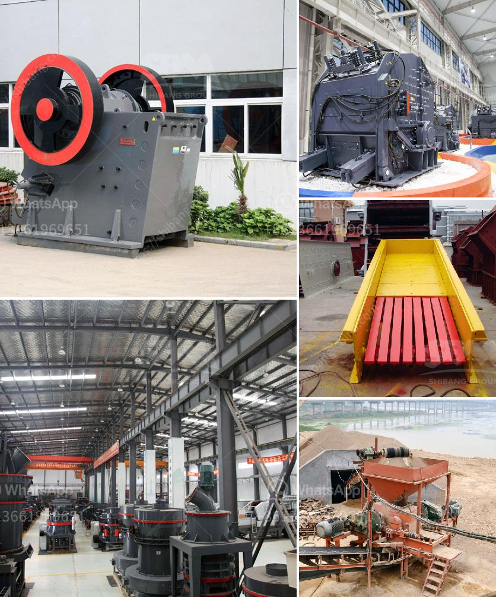

<h3>manufacturer of rotary screen for crushed lime stone</h3>
Crushed limestone is an essential ingredient in construction projects and used to pave roads, make concrete, and even act as the base material for landscaping projects. Thanks to advancements in technology, the manufacturing process of crushed limestone has become more efficient, allowing manufacturers to produce high-quality crushed limestone in large quantities. One crucial piece of equipment that plays a significant role in this process is the rotary screen.

The rotary screen is a device that is used to segregate different sizes of crushed limestone particles. It consists of a cylindrical, perforated drum made of stainless steel or mild steel. As the drum rotates, the larger limestone particles are retained inside the drum, while the smaller particles pass through the perforations and are discharged onto a conveyor belt. This process ensures that the crushed limestone is separated into different sizes, making it easier to use in various applications.

One reputable manufacturer of rotary screens for crushed limestone is XYZ Inc. With years of experience in the industry, XYZ Inc. has perfected the design and manufacturing process of their rotary screens, ensuring high efficiency and excellent quality. Here are some of the key reasons why their equipment stands out:

1. Robust Construction: XYZ Inc.'s rotary screens are constructed using high-quality materials to withstand the demanding conditions of the limestone crushing process. The stainless steel or mild steel drum is designed to resist abrasion and wear, ensuring a long service life.

2. Versatile Design: XYZ Inc.'s rotary screens are designed to handle a wide range of limestone sizes, from small particles to larger stones. The size of the drum perforations can be customized to meet specific customer requirements, allowing for greater flexibility and precision in the sieving process.

3. Easy Maintenance: XYZ Inc. recognizes the importance of minimizing downtime and maximizing productivity. Their rotary screens are designed for easy maintenance, with quick-access panels and removable parts. This makes cleaning and replacing worn-out components a hassle-free task, ensuring smooth operation and reduced maintenance costs.

4. Energy-Efficient: XYZ Inc. is committed to sustainability. Their rotary screens are designed with energy efficiency in mind, incorporating features such as variable speed drives and optimized drum rotation mechanism to minimize power consumption. This not only helps reduce operational costs but also contributes to a more environmentally friendly manufacturing process.

5. Quality Control: XYZ Inc. values customer satisfaction and the delivery of high-quality products. Their rotary screens undergo rigorous quality control checks at every stage of the manufacturing process, ensuring that each unit is reliable and performs optimally. Additionally, they offer comprehensive after-sales support, including technical assistance and spare parts availability.

In conclusion, the manufacturer of rotary screens for crushed limestone plays a crucial role in promoting efficiency and quality in the construction industry. XYZ Inc. stands out as a reputable manufacturer, providing robust, versatile, and energy-efficient rotary screens that help produce high-quality crushed limestone in large quantities. Their commitment to customer satisfaction and sustainable manufacturing practices positions them as an industry leader.
<h3>Contact us</h3><ul><li><strong>Whatsapp:&nbsp;<a href="https://wa.me/8613661969651">+8613661969651</a></strong></li><li><a href="https://swt.shibang-china.com/?git&amp;zhl&amp;manufacturer of rotary screen for crushed lime stone"><strong>Online Service(chat now)</strong></a></li></ul><h3>Related</h3><ul><li><a href='vibrating feeder vs belt conveyor.md'>vibrating feeder vs belt conveyor</a></li><li><a href='mobile coal crusher price sa.md'>mobile coal crusher price sa</a></li><li><a href='cost for starting a granite manufacturing.md'>cost for starting a granite manufacturing</a></li><li><a href='marble mining countries.md'>marble mining countries</a></li><li><a href='demand and supply of stone ballast in kenya.md'>demand and supply of stone ballast in kenya</a></li></ul>