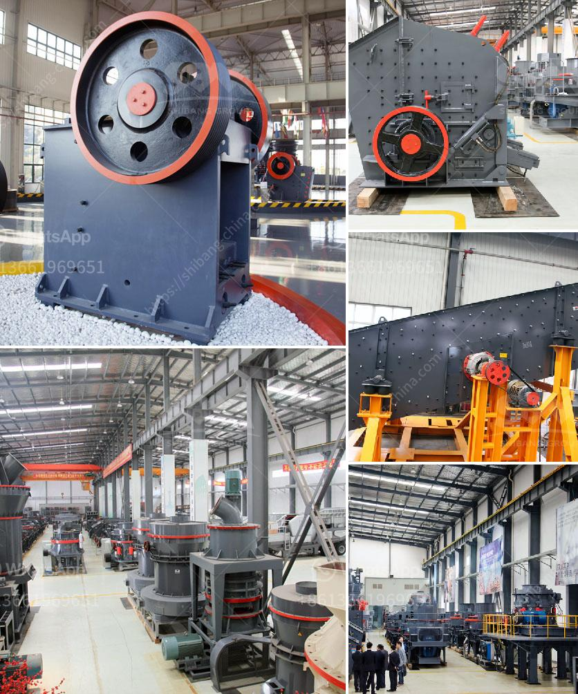

<h3>manufacturer of talc powder in uae</h3>
The talc powder manufacturing industry has gained significant momentum in the United Arab Emirates (UAE) over the years. This niche sector focuses on the production of talcum powder, a fine-grained mineral compound widely used in various industries, including cosmetics, pharmaceuticals, plastics, and paints. This article sheds light on the key aspects of talc powder manufacturing in the UAE, highlighting the key players, production processes, and quality control measures.

The UAE is home to several prominent manufacturers of talc powder, catering to both domestic and international markets. Some of the key players in the industry include XYZ Talc Company, ABC Minerals, and PQR Industries. These manufacturers have established state-of-the-art production facilities equipped with cutting-edge machinery to ensure high-quality products and meet the growing demand.

Talc powder is derived from talc, a naturally occurring mineral primarily composed of magnesium, silicon, and oxygen. The manufacturing process involves extracting talc from mineral deposits and transforming it into a fine powder form. The primary method used in the UAE is through open-pit mining, where the mineral is excavated and then subjected to a series of crushing, grinding, and refining processes. These processes eliminate impurities and generate a consistent particle size suitable for various applications.

Manufacturers in the UAE adhere to stringent quality control measures to ensure that the talc powder produced meets international standards and customer expectations. Quality control begins right from the mining stage, where thorough inspections are conducted to assess the purity and quality of talc deposits. During the manufacturing process, regular product testing, including particle size analysis and chemical composition assessment, is carried out to confirm that the talc powder conforms to specific industry requirements.

The UAE's talc powder manufacturing industry has witnessed steady growth due to the rising demand for talcum powder in various sectors. The cosmetic industry, in particular, is a significant driver of this growth, with talcum powder playing a vital role in the production of cosmetics, personal care products, and perfumes. The pharmaceutical industry also extensively uses talc powder in the production of tablets, ointments, and powders, further contributing to market demand.

The UAE's strategic location and efficient logistics infrastructure present lucrative export opportunities for local talc powder manufacturers. With high-quality production capabilities and adherence to international standards, UAE-based companies have successfully penetrated global markets. The Gulf Cooperation Council (GCC), South Asia, and Africa are among the primary export destinations.

The talc powder manufacturing industry in the UAE has evolved into a significant contributor to the country's economy. With leading manufacturers employing advanced production techniques, the industry guarantees high-quality talc powder that caters to diverse applications domestically and internationally. As the demand for talcum powder continues to grow in various industries, the UAE's manufacturers are well-positioned to capitalize on this trend and make substantial contributions to the global talc powder market.
<h3>Contact us</h3><ul><li><strong>Whatsapp:&nbsp;<a href="https://wa.me/8613661969651">+8613661969651</a></strong></li><li><a href="https://swt.shibang-china.com/?git&amp;zhl&amp;manufacturer of talc powder in uae"><strong>Online Service(chat now)</strong></a></li></ul><h3>Related</h3><ul><li><a href='high grinding mill quicklime.md'>high grinding mill quicklime</a></li><li><a href='crusher machine from south korea.md'>crusher machine from south korea</a></li><li><a href='crusher manufacturers in malaysia.md'>crusher manufacturers in malaysia</a></li><li><a href='stone crushing plant 100tph for sale.md'>stone crushing plant 100tph for sale</a></li><li><a href='stone crusher contact.md'>stone crusher contact</a></li></ul>