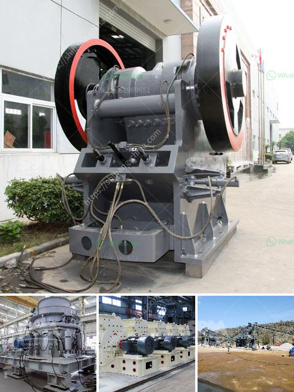

<h3>manufacturers crushing stone</h3>
Stone crushing is a crucial process in many industrial sectors, such as construction, mining, metallurgy, chemistry, and others. It is a primary stage crusher in the crushing process, reducing huge rocks into manageable-sized components for further processing. Therefore, manufacturers crushing stone encompass a wide range of industries and plays a critical role in ensuring the smooth operation of various sectors.

The process of crushing stone begins with a raw material being fed into a crusher. The manufacturer uses different types of machines depending on the desired output and requirements. For instance, jaw crushers, cone crushers, impact crushers, and gyratory crushers are commonly utilized in this process. Each machine has its unique capability and characteristics.

Jaw crushers, for example, are commonly used for primary crushing. They possess a fixed jaw plate and a movable one. As the movable jaw moves back and forth, it crushes the material against the fixed jaw plate, resulting in smaller-sized stones.

Meanwhile, cone crushers are known for their ability to produce fine, graded materials. These machines have a conical-shaped head that crushes the rocks between the mantle and the concave.

Impact crushers, on the other hand, utilize the force of impact to crush the stones. They involve rapid rotational movement augmented by high velocity impellers or hammers to generate the necessary impact.

Finally, gyratory crushers are mainly used in mining operations. These crushers have a conical head that pan and gyrates around an eccentrically rotating shaft. The rocks are crushed against a fixed concave surface, resulting in the production of smaller stones.

Manufacturers crushing stone play an essential role in sustaining various industries. For example, in the construction industry, crushed stones are used in foundations, driveways, roads, and concrete production. In mining, crushed stone is used to create a variety of different products, including gravel, which is used for construction and landscaping.

Moreover, manufacturers crushing stone also contribute to environmental conservation. Crushing large rocks into smaller pieces reduces the need for extensive mining, minimizing the negative impact on the environment. Additionally, these crushed stones can be recycled and reused in various applications, further reducing carbon emissions and waste generation.

In conclusion, manufacturers crushing stone play a crucial role in multiple industries by transforming large rocks into smaller, more manageable pieces. They employ various types of crushers, including jaw crushers, cone crushers, impact crushers, and gyratory crushers, depending on the desired output and requirements. These crushed stones are extensively used in construction, mining, and various other sectors, contributing to the overall growth and sustainability of these industries. Furthermore, the process of crushing stone also supports environmental conservation by reducing the need for extensive mining and promoting recycling.
<h3>Contact us</h3><ul><li><strong>Whatsapp:&nbsp;<a href="https://wa.me/8613661969651">+8613661969651</a></strong></li><li><a href="https://swt.shibang-china.com/?git&amp;zhl&amp;manufacturers crushing stone"><strong>Online Service(chat now)</strong></a></li></ul><h3>Related</h3><ul><li><a href='ball mill grinding relation with quality pdf.md'>ball mill grinding relation with quality pdf</a></li><li><a href='stone crusher for sale in south africa.md'>stone crusher for sale in south africa</a></li><li><a href='how to start gold mining in ghana.md'>how to start gold mining in ghana</a></li><li><a href='cone crusher from china.md'>cone crusher from china</a></li><li><a href='river stone crusher for sale.md'>river stone crusher for sale</a></li></ul>