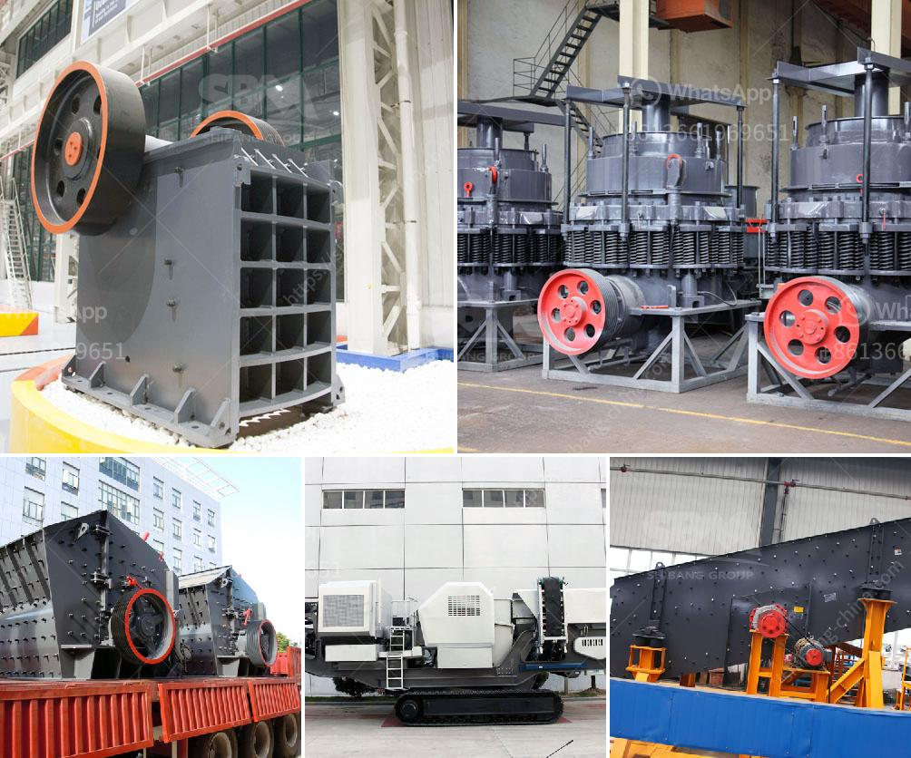

<h3>manufacturing artificial sand in malaysia</h3>
Artificial sand, also known as crushed sand or mechanical sand, refers to rocks, mine tailings, or industrial waste granules with a particle size of less than 4.75 mm. It is processed by mechanical crushing and sieving. In China, the artificial sand was mainly used in the construction of hydropower systems.

For a long time, the natural sand and gravel have been transported to the industry's construction sites for use due to their good particle shape, liquidity, and economic advantages. However, with the overexploitation of natural sand, the environmental damage caused by river sand mining has gradually increased. Moreover, natural sand is often accompanied by impurities such as organic matter and clay, which affects the quality of concrete.

To cope with the depletion of natural sand resources, many countries have started to produce and use artificial sand. Malaysia is one of the countries that has successfully implemented artificial sand manufacturing plants. This machine-made sand production line, which equipped with SBM VU120 System, is put into operation at February, 2015. The raw material is stone tailing which is under 10mm.

At first, the raw material be crushed and optimized by the VU crusher, the the material will be divided into stone powder, return product and semi-finished product by the fully automatic “Stone-to-Stone” grinding machine. Then, the stone powder and middle grade sand is produced, which meets the national standard of building sand. Furthermore, the aggregate of machine-made sand is crisp with edges and corners, has small needle-like particles, and good particle shape, which is suitable for high-strength concrete production.

By producing machine-made sand, the cost is about 40% lower than that of river sand, moreover, the quality of concrete can be significantly improved by using machine-made sand. Malaysia is taking advantage of its abundant resources to manufacture artificial sand in order to save construction costs and gain profits. Therefore, the construction industry and governments in various countries are actively promoting the use of machine-made sand to ease the overexploitation of natural resources and protect the environment.
<h3>Contact us</h3><ul><li><strong>Whatsapp:&nbsp;<a href="https://wa.me/8613661969651">+8613661969651</a></strong></li><li><a href="https://swt.shibang-china.com/?git&amp;zhl&amp;manufacturing artificial sand in malaysia"><strong>Online Service(chat now)</strong></a></li></ul><h3>Related</h3><ul><li><a href='iron crusher supplier.md'>iron crusher supplier</a></li><li><a href='ball mill for sale south africa.md'>ball mill for sale south africa</a></li><li><a href='flow chart of three stage agreegate crushing plant.md'>flow chart of three stage agreegate crushing plant</a></li><li><a href='small ball mill price.md'>small ball mill price</a></li><li><a href='silica sand washing purification.md'>silica sand washing purification</a></li></ul>