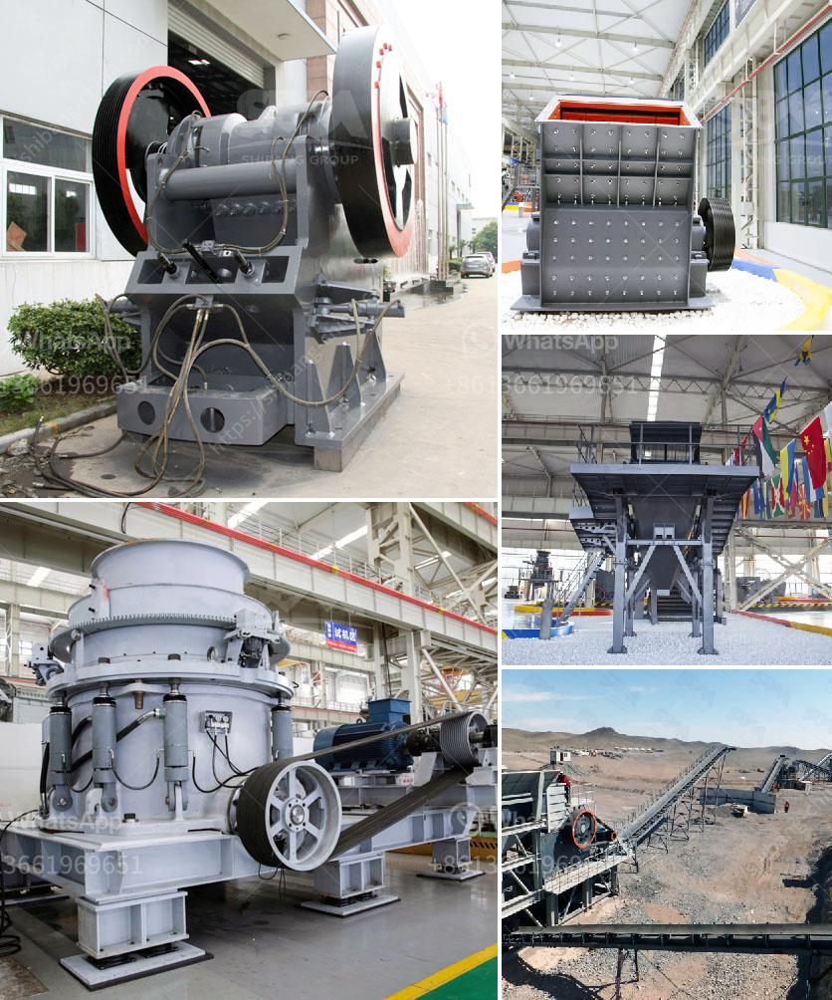

<h3>manufacturing of talcum powder</h3>
Talcum powder is a widely recognized beauty and personal care product, known for its smooth and soft texture. Its manufacturing process involves a careful combination of various ingredients to create the desired consistency and quality. Let’s delve into the process of manufacturing talcum powder.

The primary component of talcum powder is talc, a naturally occurring mineral known for its excellent absorbent properties. It is also extremely soft and fine, making it perfect for application on the skin. The extraction of talc involves mining deposits and crushing the ore into a fine powder.

To ensure purity and consistency, the extracted talc is then refined through a meticulous process. This process involves washing and drying the talc, followed by milling and grinding to achieve the desired particle size.

In mixing talc with other ingredients, manufacturers aim to enhance its performance and add additional benefits. Typical ingredients may include fragrances, natural oils, and other moisturizing additives. These ingredients are mixed together in precise proportions using specialized machines to ensure proper distribution.

The next step is to blend and homogenize the mixture. This is done to improve the powder's texture and prevent any clumping or unevenness. The blended mixture is then passed through sieves to further refine the powder and achieve a uniform particle size.

Once the talcum powder is properly blended and refined, it is packaged into containers such as bottles or aerosol cans. These containers are sealed to preserve the freshness and integrity of the product.

The manufacturing process of talcum powder requires careful attention to detail and adherence to quality standards. Strict quality control measures are implemented throughout the production process to maintain product consistency and safety.

In conclusion, the manufacturing of talcum powder involves extracting, refining, blending, and packaging talc with other ingredients to create a high-quality product. Its soft and smooth texture, combined with various additional benefits, make talcum powder a popular choice in the beauty and personal care industry.
<h3>Contact us</h3><ul><li><strong>Whatsapp:&nbsp;<a href="https://wa.me/8613661969651">+8613661969651</a></strong></li><li><a href="https://swt.shibang-china.com/?git&amp;zhl&amp;manufacturing of talcum powder"><strong>Online Service(chat now)</strong></a></li></ul><h3>Related</h3><ul><li><a href='enquiry jaw crusher.md'>enquiry jaw crusher</a></li><li><a href='rock crushing price.md'>rock crushing price</a></li><li><a href='50 tph stone crusher plant price.md'>50 tph stone crusher plant price</a></li><li><a href='high reversible mill with 750 mm diameter rolls.md'>high reversible mill with 750 mm diameter rolls</a></li><li><a href='how to dismantle brand jaw crusher.md'>how to dismantle brand jaw crusher</a></li></ul>