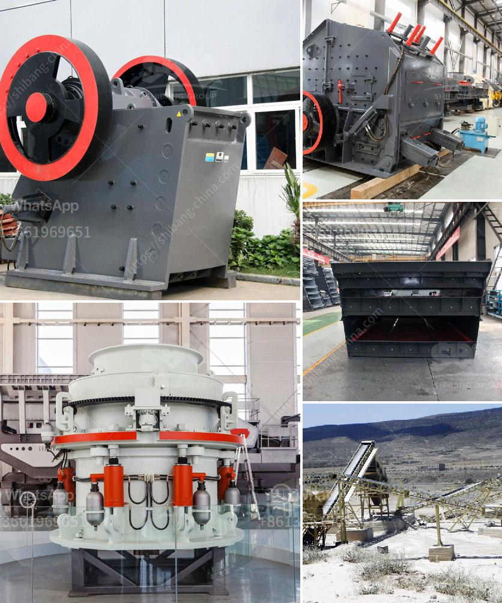

<h3>manufacturing process of bentonite powder</h3>
Bentonite is a versatile and unique material that has various industrial applications. One of the most common uses of bentonite is in the manufacturing of bentonite powder. This fine, granular material is widely used in industries such as construction, oil and gas, cosmetics, agriculture, and pharmaceuticals. In this article, we will explore the manufacturing process of bentonite powder.

The manufacturing process of bentonite powder begins with the extraction of bentonite ore. Bentonite mines are located worldwide and range from large-scale open-pit operations to small underground mines. After the extraction, the ore is transported to a processing plant for further processing.

At the processing plant, the bentonite ore is crushed and ground to achieve the desired particle size and consistency. It is then dried in a rotary dryer to remove any moisture present in the ore. The dried ore is then pulverized using various grinding mills, which break it down into fine, powdered particles.

After pulverization, the bentonite powder is sieved to remove any impurities or oversized particles. This ensures that the final product meets the required specifications and standards. The sieved powder is then stored in silos or bags for further packaging and distribution.

During the manufacturing process, various additives and chemicals may be added to improve the qualities of the bentonite powder. These additives can enhance its stability, viscosity, and performance for specific applications. Some common additives include sodium carbonate, sodium bicarbonate, calcium carbonate, and polymers.

Quality control is an essential aspect of the manufacturing process. Regular testing and analysis are conducted to ensure that the bentonite powder meets the required quality standards. Parameters such as moisture content, particle size distribution, bulk density, and chemical composition are monitored to ensure consistency and reliability of the final product.

The manufactured bentonite powder is then packed and ready for distribution. It is commonly shipped in bags of various sizes to customers globally. The packaging material is chosen carefully to protect the powder from moisture and contamination during transportation and storage.

In conclusion, the manufacturing process of bentonite powder involves the extraction, crushing, drying, pulverization, sieving, and packaging of bentonite ore. Additives may be used to enhance its properties, and quality control measures are in place to ensure consistent and reliable production. With its wide range of industrial applications, bentonite powder plays a crucial role in various industries worldwide.
<h3>Contact us</h3><ul><li><strong>Whatsapp:&nbsp;<a href="https://wa.me/8613661969651">+8613661969651</a></strong></li><li><a href="https://swt.shibang-china.com/?git&amp;zhl&amp;manufacturing process of bentonite powder"><strong>Online Service(chat now)</strong></a></li></ul><h3>Related</h3><ul><li><a href='india stone crusher machine.md'>india stone crusher machine</a></li><li><a href='sand washing process.md'>sand washing process</a></li><li><a href='crushing machine pakistan.md'>crushing machine pakistan</a></li><li><a href='how much does sand processing plant cost.md'>how much does sand processing plant cost</a></li><li><a href='quartz crusher prices.md'>quartz crusher prices</a></li></ul>