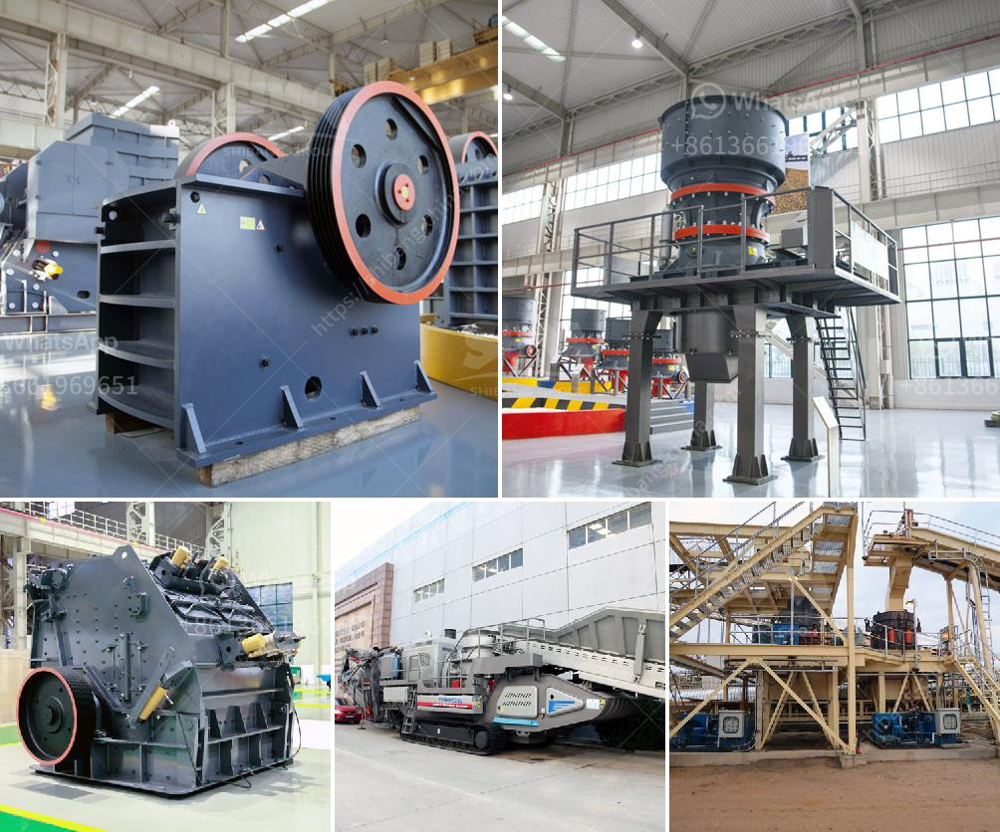

<h3>manufacturing process of cement</h3>
The manufacturing process of cement is a complex and energy-intensive one. It involves several steps, each of which has its own unique set of challenges and requirements. Let's take a closer look at how cement is produced.

The first step in cement manufacturing is quarrying the raw materials. Limestone, clay, and other materials are extracted from quarries, and then crushed into smaller pieces. These raw materials are then transported to the cement plant, where they are stored and further processed.

The next step is the preparation of the raw materials. The crushed materials are carefully proportioned and blended to achieve the desired chemical composition. This composition is crucial, as it determines the quality and properties of the final product.

Once the raw materials are prepared, they are fed into a kiln for the main manufacturing process. The kiln operates at extremely high temperatures, typically around 1450 degrees Celsius. This is where the raw materials react chemically, forming clinker. Clinker is a nodular material that is the main component of cement.

After the clinker is formed, it is cooled and ground into a fine powder. This powder, called cement, is then blended with gypsum and other additives to enhance its properties. The final product is cement, which is packed into bags or delivered in bulk to construction sites.

The manufacturing process of cement is highly energy-intensive and involves the release of carbon dioxide as a byproduct. As a result, the cement industry has been actively seeking ways to reduce its environmental impact. Innovative technologies, such as carbon capture and utilization, are being explored to capture and reuse carbon emissions generated during the manufacturing process.

In conclusion, the manufacturing process of cement is a complex and energy-intensive one. It involves quarrying and crushing raw materials, preparing them for the kiln, and then producing clinker. After the clinker is cooled and ground, it is blended with additives to create cement. The industry is also actively working towards making this process more sustainable and environmentally friendly.
<h3>Contact us</h3><ul><li><strong>Whatsapp:&nbsp;<a href="https://wa.me/8613661969651">+8613661969651</a></strong></li><li><a href="https://swt.shibang-china.com/?git&amp;zhl&amp;manufacturing process of cement"><strong>Online Service(chat now)</strong></a></li></ul><h3>Related</h3><ul><li><a href='price of gypsum processing plant.md'>price of gypsum processing plant</a></li><li><a href='indopol roller grinding mills.md'>indopol roller grinding mills</a></li><li><a href='sand washing plant process.md'>sand washing plant process</a></li><li><a href='saudi arabia used conveyor belts price.md'>saudi arabia used conveyor belts price</a></li><li><a href='sell stone crusher in philippines.md'>sell stone crusher in philippines</a></li></ul>