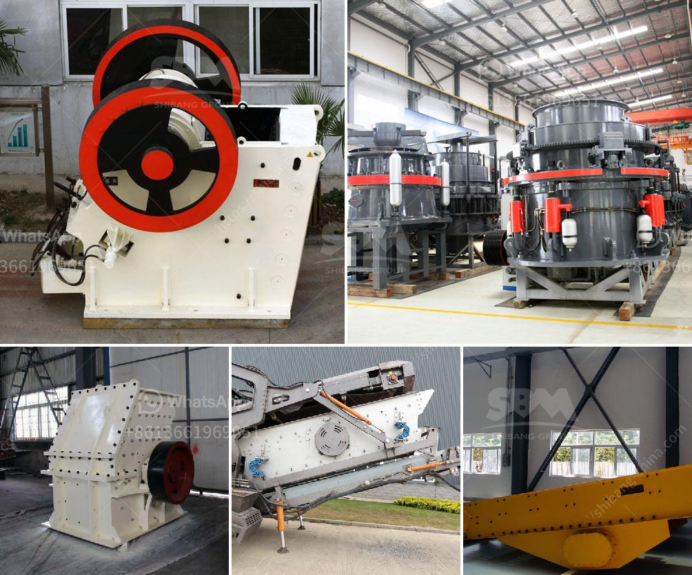

<h3>marble grinding machine bosch make</h3>
Marble is a natural stone known for its elegance and durability. Many homeowners choose marble flooring and countertops to add a touch of luxury to their interiors. However, over time, marble can lose its shine and develop scratches and dullness. This is where a marble grinding machine like the Bosch make can come to your rescue.

The Bosch make marble grinding machine is a top-quality tool designed to restore the original beauty of your marble surfaces. It features a powerful motor and diamond abrasive blades that effectively remove scratches and stains from the surface, bringing back its glossy finish. Whether you need to polish a small area or an entire floor, this machine can deliver excellent results.

One of the key benefits of the Bosch make marble grinding machine is its user-friendly design. It is equipped with a comfortable handle and adjustable settings, allowing you to easily control the grinding process. You can choose the desired speed and pressure to achieve the desired outcome without damaging the marble. The machine also offers a dust extraction feature, keeping your workspace clean and safe.

Investing in a marble grinding machine like the Bosch make has several advantages. First and foremost, you can save significant costs on hiring professional marble restoration services. With a one-time investment in this machine, you can perform regular maintenance and keep your marble surfaces in top condition for years to come.

Moreover, having a marble grinding machine at your disposal gives you the flexibility to schedule the restoration process as per your convenience. You are not dependent on external service providers and can address any issues as soon as they arise. This ensures that your marble surfaces always look their best, impressing guests and enhancing the overall aesthetics of your home.

In conclusion, a marble grinding machine such as the Bosch make is an indispensable tool for homeowners who appreciate the beauty of marble surfaces. With its powerful motor, adjustable settings, and dust extraction feature, this machine makes the restoration process smooth and hassle-free. Investing in this tool can save you time and money, while ensuring that your marble surfaces remain stunning for years to come.
<h3>Contact us</h3><ul><li><strong>Whatsapp:&nbsp;<a href="https://wa.me/8613661969651">+8613661969651</a></strong></li><li><a href="https://swt.shibang-china.com/?git&amp;zhl&amp;marble grinding machine bosch make"><strong>Online Service(chat now)</strong></a></li></ul><h3>Related</h3><ul><li><a href='grinding roller mills manufacturer from china.md'>grinding roller mills manufacturer from china</a></li><li><a href='cost for small cement plant setup.md'>cost for small cement plant setup</a></li><li><a href='zircon sand supplier in singapore.md'>zircon sand supplier in singapore</a></li><li><a href='calcium carbonate grinding plant feasibility.md'>calcium carbonate grinding plant feasibility</a></li><li><a href='crushing plant in the philippines.md'>crushing plant in the philippines</a></li></ul>