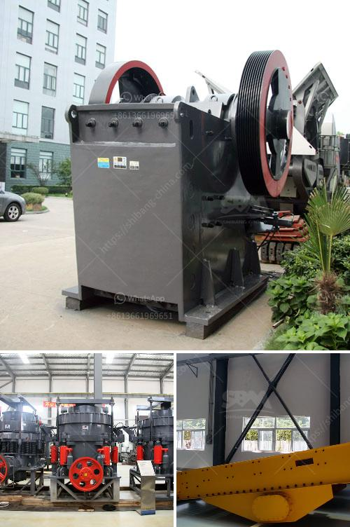

<h3>marble mining countries</h3>
Marble has been mined for centuries and is a vital resource used in construction, art, and decoration. There are several countries known for their marble mining operations, which play a significant role in the global marble industry. Let's explore some of these countries and their contributions to the lucrative marble trade.

Italy is often considered the birthplace of the modern marble industry and continues to be one of the leaders in global marble mining. Italian marble is renowned for its high quality, unique patterns, and luxurious appearance. The Carrara region in Tuscany, Italy, has been a hub for marble mining since ancient times. It is home to the famous Carrara marble, which has been used in iconic structures like the Pantheon in Rome and Michelangelo's masterpiece, David. Italy's marble industry is known for its craftsmanship and artistry, making it a favored choice for architects and designers worldwide.

India is another prominent player in the global marble mining market. The country is the largest producer of dimensional stones, including marble, in the world. Rajasthan, a state in northern India, is the center of the country's marble production. The city of Udaipur, in particular, is known for its abundant marble deposits and is often referred to as the "Marble City of India." Indian marble is valued for its range of colors, durability, and affordability, making it a popular choice for both domestic and international markets.

China has emerged as a significant force in the marble mining industry in recent years. The country possesses vast marble reserves and has significantly increased its production and exports. Guangdong, Fujian, and Sichuan provinces in China are major marble mining regions. Chinese marble is known for its unique patterns and wide range of color options. With advancements in mining technology and growing demand, China has become a formidable competitor in the global marble market.

Turkey is also a significant player in the marble industry, boasting abundant marble reserves and a long history of marble production. The country's marble quarries are primarily concentrated in the Aegean and Marmara regions. Turkish marble is renowned for its diverse patterns and colors, ranging from pure white to vibrant reds and greens. Turkey is a leading exporter of marble, supplying high-quality stones to markets worldwide.

Other countries that contribute to the global marble mining industry include Spain, Greece, Brazil, and Iran. These countries are known for their unique marble varieties that cater to specific market demands. For example, Spain's Macael marble is highly sought-after for its pure white color and uniform texture. Greece offers the characteristic white and blue marble found in the ancient ruins of Athens. Brazil is known for its exotic marble, featuring striking patterns and colors, while Iran produces highly valued, richly veined marbles.

In conclusion, several countries play a vital role in the marble mining industry. Each nation offers its unique variety of marble, known for its distinct characteristics and aesthetic appeal. From Italy's high-quality craftsmanship to India's affordability and China's massive production capacity, these countries contribute to global marble trade, fulfilling the demands of various markets and satisfying the desires of architects, designers, and consumers worldwide.
<h3>Contact us</h3><ul><li><strong>Whatsapp:&nbsp;<a href="https://wa.me/8613661969651">+8613661969651</a></strong></li><li><a href="https://swt.shibang-china.com/?git&amp;zhl&amp;marble mining countries"><strong>Online Service(chat now)</strong></a></li></ul><h3>Related</h3><ul><li><a href='vibrating screen suppliers in philippines.md'>vibrating screen suppliers in philippines</a></li><li><a href='cobalt ore processing plant setup cost.md'>cobalt ore processing plant setup cost</a></li><li><a href='price copper concentration plant.md'>price copper concentration plant</a></li><li><a href='stamp mill for sale in zimbabwe.md'>stamp mill for sale in zimbabwe</a></li><li><a href='stone crusher machines ebay.md'>stone crusher machines ebay</a></li></ul>