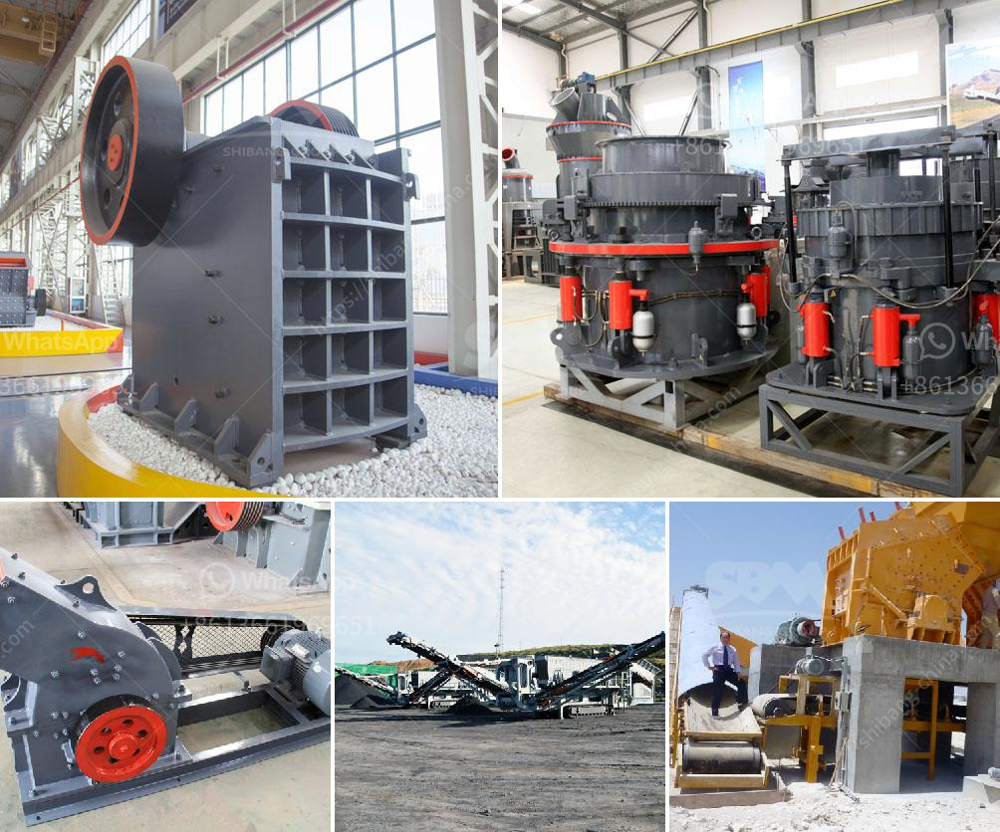

<h3>marble mining equipments</h3>
Marble is a natural stone that is widely used in building and decoration materials. It is a highly sought-after material for creating beautiful and luxurious spaces, as it exudes elegance and sophistication. To extract marble from its deposits, a mining operation is required. This process involves the use of various types of equipment that facilitate the extraction, transportation, and processing of marble.

One of the essential pieces of equipment used in marble mining is the diamond wire saw. This tool allows for precise cutting of marble blocks, as it penetrates through the hard material with ease. The diamond wire saw consists of thin wires embedded with diamond beads, which are coated or infused with industrial-grade diamonds. As the wire saw runs along the marble surface, it smoothly cuts through the stone, resulting in clean and precise blocks.

Excavators are also widely used in marble mining operations. These heavy-duty machines are designed to efficiently move large amounts of soil, debris, and rocks. Excavators are equipped with a bucket attachment that can scoop up and transport marble blocks from the mining site to the processing area. Their powerful engines and hydraulic systems allow for swift and precise movements, enabling marble miners to extract the stones effectively.

Front-end loaders are another type of equipment commonly used in marble mining. These machines are capable of lifting and loading heavy marble blocks onto trucks for transportation. Front-end loaders typically have a large bucket attached to their front end, which can scoop up large amounts of material and deposit it into trucks. Their powerful engines and robust construction make them ideal for handling the heavyweights of marble blocks.

Once marble blocks are transported to the processing area, saws and polishing machines are used to shape and refine the stones further. Gang saws are commonly employed to slice large marble blocks into smaller slabs or tiles. These large machines typically feature multiple blades that move vertically to make precise cuts. After cutting, polishing machines are used to give the marble slabs their shiny and smooth finish. These machines employ abrasive pads or wheels that rotate and polish the surface of the marble, enhancing its natural beauty.

In recent years, advancements in technology have introduced more efficient and automated equipment for marble mining operations. For instance, robotic drilling machines are now being used to extract marble blocks with minimal manual labor. These machines are equipped with advanced sensors and motors, which allow them to accurately drill holes in the marble for the placement of explosive charges. This automation not only increases productivity but also reduces the risks associated with manual drilling.

In conclusion, the extraction and processing of marble require a range of specialized equipment. Diamond wire saws, excavators, front-end loaders, saws, and polishing machines are just a few examples of the equipment used in marble mining. With advancements in technology, the mining industry continues to develop more efficient and automated machines for extracting marble, ensuring the availability of this beautiful natural stone for various construction and decoration projects.
<h3>Contact us</h3><ul><li><strong>Whatsapp:&nbsp;<a href="https://wa.me/8613661969651">+8613661969651</a></strong></li><li><a href="https://swt.shibang-china.com/?git&amp;zhl&amp;marble mining equipments"><strong>Online Service(chat now)</strong></a></li></ul><h3>Related</h3><ul><li><a href='manufacturer of rotary screen for crushed lime stone.md'>manufacturer of rotary screen for crushed lime stone</a></li><li><a href='ball mill in wait of ball.md'>ball mill in wait of ball</a></li><li><a href='quartz silica pulverizer machine.md'>quartz silica pulverizer machine</a></li><li><a href='the cost to construct a cement factory.md'>the cost to construct a cement factory</a></li><li><a href='vibrating feeder vs belt conveyor.md'>vibrating feeder vs belt conveyor</a></li></ul>