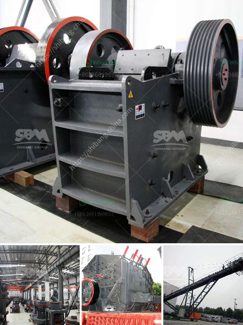

<h3>marble powder mill</h3>
Marble has been widely used as a decorative material in various industries for centuries. However, the production process of this exquisite material involves the creation of marble dust or powder, which needs to be efficiently processed. This is where a marble powder mill comes into play, offering an essential solution to grind and refine the marble dust for further use.

A marble powder mill is a specialized piece of equipment that can grind marble fragments into a fine powder. This powder is ideal for use as a raw material in various industries including construction, ceramics, and paints. It can even be used for pharmaceutical and cosmetic applications.

The marble powder mill utilizes a combination of compression and impact forces to reduce the size of marble fragments. It is equipped with rotating hammers or blades that crush the marble into smaller particles. These particles then pass through a series of grinding plates or screens, where the desired fineness is achieved.

One of the major advantages of using a marble powder mill is its high efficiency. The powerful grinding mechanism and adjustable settings allow for precise control over the particle size and consistency of the final product. This ensures that the powder meets the specific requirements of different applications.

Moreover, a marble powder mill is designed to minimize product loss and prevent contamination. The equipment is equipped with advanced dust collection systems to capture and remove any airborne particles, ensuring a clean and safe working environment.

In recent years, there has been an increasing demand for environmentally friendly practices in various industries. A marble powder mill fits perfectly with this trend as it helps reduce waste by utilizing marble fragments that would otherwise be discarded. It also offers a sustainable alternative to traditional raw materials, promoting a circular economy.

In conclusion, a marble powder mill is an essential equipment for processing marble dust. Its efficient grinding mechanism and precise control over particle size make it a valuable tool in various industries. Furthermore, its ability to reduce waste and promote sustainable practices make it an attractive choice for environmentally conscious businesses.
<h3>Contact us</h3><ul><li><strong>Whatsapp:&nbsp;<a href="https://wa.me/8613661969651">+8613661969651</a></strong></li><li><a href="https://swt.shibang-china.com/?git&amp;zhl&amp;marble powder mill"><strong>Online Service(chat now)</strong></a></li></ul><h3>Related</h3><ul><li><a href='silica sand refind machines in germany.md'>silica sand refind machines in germany</a></li><li><a href='quartz making machine.md'>quartz making machine</a></li><li><a href='stone crusher price list 300 tonnes capacity per hour.md'>stone crusher price list 300 tonnes capacity per hour</a></li><li><a href='overland conveyor belt system cost estimates.md'>overland conveyor belt system cost estimates</a></li><li><a href='stone crusher for sale in uae.md'>stone crusher for sale in uae</a></li></ul>