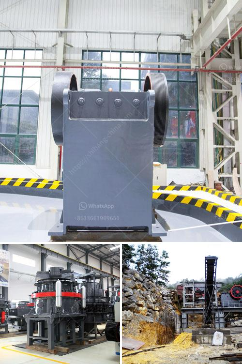

<h3>marble powder plant</h3>
Marble is a stunning natural stone widely used in construction and decoration projects worldwide. However, the extraction and processing of marble results in a significant amount of waste in the form of marble powder. Thankfully, innovative technology has allowed us to find value in this waste by creating marble powder plants that effectively recycle and utilize this material.

A marble powder plant is a facility that processes waste marble into various useful products. By transforming this waste into valuable resources, these plants bring multiple benefits to the construction and manufacturing industries while also reducing the environmental impact.

One major advantage of marble powder plants is their ability to create eco-friendly substitutes for natural marble. Marble powder can be mixed with binders and pigments to produce synthetic marble, also known as engineered marble or cultured marble. This synthetic marble possesses the same aesthetic appeal as natural marble but at a fraction of the cost. Furthermore, synthetic marble is highly customizable, allowing for the production of unique colors, patterns, and designs.

Apart from synthetic marble, marble powder plants can also produce other construction materials such as adhesives, paints, and coatings. With the addition of marble powder, these materials gain enhanced qualities like improved strength, durability, and weather resistance. Incorporating marble powder into products can thus lead to more sustainable and long-lasting structures.

In addition to reducing waste and creating sustainable alternatives, marble powder plants also contribute to resource conservation. Traditionally, the production of construction materials requires significant amounts of raw materials, such as limestone and silica. However, by utilizing waste marble in the form of powder, these plants lessen the demand for virgin resources, making the manufacturing process more sustainable.

Furthermore, marble powder plants play a significant role in reducing landfill waste. The disposal of marble waste in landfills contributes to environmental degradation and takes up valuable land space. By processing this waste and transforming it into useful products, marble powder plants help alleviate the strain on landfills and support a more efficient waste management system.

Moreover, the establishment of marble powder plants provides economic opportunities and job creation. These facilities require skilled labor to operate and maintain the specialized machinery involved in the production process. Additionally, the demand for synthetic marble and other marble-based products opens up new markets and business opportunities for entrepreneurs and manufacturers.

In conclusion, marble powder plants have revolutionized the way we perceive and utilize waste marble. By transforming this waste into valuable resources, these plants contribute to sustainable construction practices, reduce environmental impact, conserve resources, and create economic opportunities. With the growing awareness of environmental concerns and the need for sustainable solutions in various industries, the establishment and expansion of marble powder plants are undeniably crucial steps towards a greener future.
<h3>Contact us</h3><ul><li><strong>Whatsapp:&nbsp;<a href="https://wa.me/8613661969651">+8613661969651</a></strong></li><li><a href="https://swt.shibang-china.com/?git&amp;zhl&amp;marble powder plant"><strong>Online Service(chat now)</strong></a></li></ul><h3>Related</h3><ul><li><a href='gold crushers sale.md'>gold crushers sale</a></li><li><a href='100 ton hour crushing.md'>100 ton hour crushing</a></li><li><a href='jaw crusher and cone crusher manufacturers in dubai.md'>jaw crusher and cone crusher manufacturers in dubai</a></li><li><a href='top german mining equipment manufacturers.md'>top german mining equipment manufacturers</a></li><li><a href='crushing equipment in south africa.md'>crushing equipment in south africa</a></li></ul>