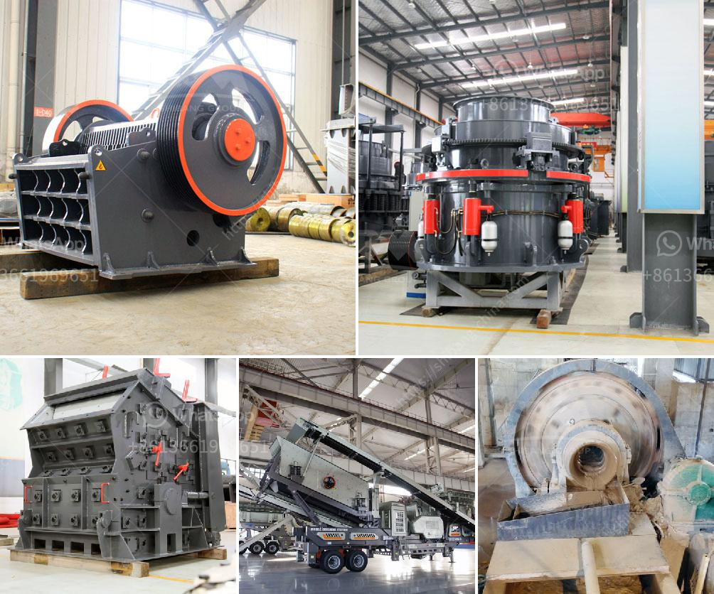

<h3>marble quarry business plan</h3>
Marble is a natural gift of Mother Earth that has been appreciated for centuries. It is a metamorphic rock composed of recrystallized carbonate minerals, mainly calcite and dolomite. Marble provides a classic and elegant look that cannot be replicated by any other material. With its vast range of colors and patterns, marble is highly sought after for various applications, including flooring, countertops, sculptures, and more.

One way to tap into the lucrative marble industry is to set up a marble quarry business. Although this requires substantial initial investment, it is also a profitable venture that entails significant revenue in the long term. To successfully set up a quarry, it is essential to investigate the local market demand, operation costs, and competition.

Before opening a quarry, it is crucial to work with a geological expert to survey the potential site thoroughly. The expert will assess the geological features of the area and determine the quality and quantity of marble deposits. Identifying a high-quality marble quarry can be a challenging task, but it is essential for the success of the business.

Once a suitable quarry site is identified, it is necessary to prepare a comprehensive business plan that outlines the operational aspect of the quarry. This includes estimating the initial costs to acquire the necessary equipment, obtaining appropriate permits, hiring manpower, and dealing with operational expenses.

A well-crafted business plan should also include market analysis, which offers insights into potential customers and competitors. Understanding the target market is crucial to ensure the quarry can provide the types and quantities of marble demanded by customers. This may involve conducting market surveys, studying construction trends, and identifying potential buyers, such as architects, contractors, and homeowners.

Another crucial aspect of the business plan is financial projections. This includes estimating the revenue and expenses, calculating return on investment, and predicting future growth. It is important to be realistic and conservative with these projections, taking into account factors such as fluctuating market prices and unexpected expenses.

Securing funding is another crucial step in setting up a marble quarry business. This can be done by approaching investors, applying for loans, or seeking partnerships. Having a well-prepared business plan increases the chances of attracting potential investors and lenders, as it demonstrates a clear understanding of the industry and the potential for profit.

Operational management is vital to ensure the smooth running of the marble quarry. This includes hiring skilled manpower, implementing proper safety protocols, maintaining machinery, and overseeing day-to-day operations. It is also essential to comply with environmental regulations and ensure sustainable practices are in place to mitigate any potential harm to the environment.

In conclusion, starting a marble quarry business requires a comprehensive understanding of both the market and operational aspects. To succeed in the industry, a well-crafted business plan and sufficient financial investment are necessary. With careful market analysis, strategic planning, and effective management, a marble quarry can become a profitable venture for years to come.
<h3>Contact us</h3><ul><li><strong>Whatsapp:&nbsp;<a href="https://wa.me/8613661969651">+8613661969651</a></strong></li><li><a href="https://swt.shibang-china.com/?git&amp;zhl&amp;marble quarry business plan"><strong>Online Service(chat now)</strong></a></li></ul><h3>Related</h3><ul><li><a href='barite crushing machine from germany.md'>barite crushing machine from germany</a></li><li><a href='different types of vibrating screen.md'>different types of vibrating screen</a></li><li><a href='fuel rate for rock crushers.md'>fuel rate for rock crushers</a></li><li><a href='rock crusher used in mining and quarry for sale.md'>rock crusher used in mining and quarry for sale</a></li><li><a href='pulverized ball mills.md'>pulverized ball mills</a></li></ul>