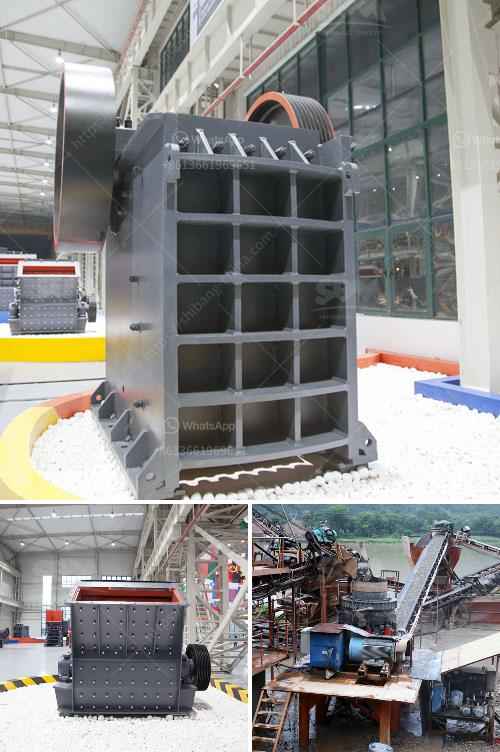

<h3>material of mantles ball mills</h3>
Ball mills are essential equipment in grinding and crushing processes in various industries, including mining, cement, and chemical manufacturing. One critical component of the ball mill that is often subjected to high wear is the mantle, which forms the moving surface within the mill. Selecting the appropriate material for mantles is crucial to ensure optimal performance and longevity of the equipment.

When it comes to choosing the material for mantles of ball mills, several factors need to be considered. Firstly, the material needs to possess excellent wear resistance to withstand the abrasive forces generated during the grinding process. Secondly, it should have sufficient mechanical strength to withstand the heavy impact and load forces imposed by the grinding media. Furthermore, the material should have good resistance to thermal shock, as temperature fluctuations within the mill can occur during operation. Lastly, the selected material should have low density to prevent excessive strain on the mill and reduce energy consumption.

One widely used material for mantles of ball mills is high chromium white cast iron (HCWCI). HCWCI is known for its exceptional wear resistance, high hardness, and good impact resistance. Additionally, it exhibits excellent corrosion resistance, which is crucial in wet grinding applications. However, HCWCI is relatively brittle and prone to breakage under severe impact loads. To overcome this limitation, a combination of HCWCI and other materials like rubber or polyurethane can be used to create composite mantles that offer enhanced impact resistance while maintaining excellent wear resistance.

Another material commonly used for mantles is high-density alumina ceramic. Alumina ceramics are highly resistant to wear and chemical corrosion, making them suitable for grinding operations involving abrasive materials or corrosive slurries. However, alumina ceramics are more brittle than HCWCI and may require careful handling to avoid cracking.

Choosing the appropriate material for mantles of ball mills is crucial to ensure prolonged equipment lifespan and consistent grinding performance. High chromium white cast iron is a popular choice due to its exceptional wear resistance and corrosion resistance. However, its brittleness may limit its application in severe impact environments, which can be addressed by using composite mantles. High-density alumina ceramics offer outstanding wear and corrosion resistance but require careful handling due to their brittleness.

Ultimately, the choice of material should be based on a comprehensive understanding of the grinding process, the materials being processed, and the operating conditions of the ball mill to ensure optimal performance and longevity.
<h3>Contact us</h3><ul><li><strong>Whatsapp:&nbsp;<a href="https://wa.me/8613661969651">+8613661969651</a></strong></li><li><a href="https://swt.shibang-china.com/?git&amp;zhl&amp;material of mantles ball mills"><strong>Online Service(chat now)</strong></a></li></ul><h3>Related</h3><ul><li><a href='manufacturer of ball mill india.md'>manufacturer of ball mill india</a></li><li><a href='mobile crushing machines.md'>mobile crushing machines</a></li><li><a href='stone crusher for sale in south africa.md'>stone crusher for sale in south africa</a></li><li><a href='19mm crusher stone philippines quarry.md'>19mm crusher stone philippines quarry</a></li><li><a href='mining industry in mpumalanga.md'>mining industry in mpumalanga</a></li></ul>