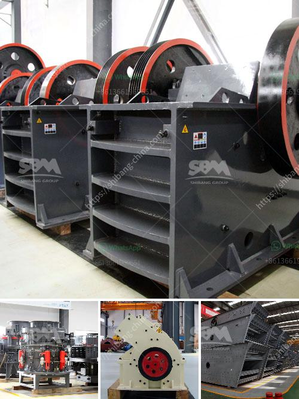

<h3>material of sectional conveyor belts</h3>
Sectional conveyor belts are widely used in various industries for transporting goods and materials efficiently. These belts consist of individual sections that are connected together, allowing for easy assembly and customization based on the specific needs of the application. The material used in the construction of sectional conveyor belts plays a crucial role in their overall performance and durability.

One common material used in sectional conveyor belts is rubber. Rubber belts are known for their excellent grip and flexibility, making them suitable for conveying different types of materials, from light to heavy loads. The rubber material is highly resistant to abrasion, which helps to prolong the life of the conveyor belt, especially in tough industrial environments.

Another material option for sectional conveyor belts is plastic. Plastic belts are known for their durability and resistance to chemical corrosion, making them ideal for industries such as food processing and pharmaceuticals. These belts are easy to clean, ensuring hygienic production processes and compliance with safety regulations. Plastic belts are also lightweight, reducing the weight load on the conveyor system, resulting in energy savings.

Metal is another material used in the construction of sectional conveyor belts. Metal belts are known for their high strength and ability to withstand heavy loads. They are commonly used in industries such as mining and construction, where heavy-duty applications are prevalent. Metal belts can withstand high temperatures and are resistant to flame, making them suitable for industries with extreme working conditions.

Each material used in sectional conveyor belts has its advantages and limitations, which should be carefully considered when selecting the appropriate belt for a specific application. Factors such as the type of material to be transported, speed, and the environment in which the conveyor operates all influence the material selection.

Apart from the material used, the design of sectional conveyor belts also plays a significant role in their performance. The belt must be designed to have the appropriate grip, flexibility, and strength to ensure smooth and efficient material transportation. Different belt designs, such as flat, cleated, or corrugated, are available to suit specific application requirements.

Regular maintenance and proper care of sectional conveyor belts are essential to ensure optimal performance and extend their lifespan. Cleaning the belts regularly to remove any debris or buildup, inspecting for any signs of wear or damage, and replacing worn-out sections promptly are some of the maintenance practices that should be followed.

In conclusion, sectional conveyor belts play a vital role in various industries for efficient materials handling. The material used in their construction, whether it's rubber, plastic, or metal, determines their grip, durability, and resistance to wear and tear. Careful consideration of the material selection, along with proper maintenance, ensures optimal performance, durability, and longevity of the sectional conveyor belt system.
<h3>Contact us</h3><ul><li><strong>Whatsapp:&nbsp;<a href="https://wa.me/8613661969651">+8613661969651</a></strong></li><li><a href="https://swt.shibang-china.com/?git&amp;zhl&amp;material of sectional conveyor belts"><strong>Online Service(chat now)</strong></a></li></ul><h3>Related</h3><ul><li><a href='high efficient grinding mills for sale.md'>high efficient grinding mills for sale</a></li><li><a href='price of plants crushing.md'>price of plants crushing</a></li><li><a href='ball mills in solidwork.md'>ball mills in solidwork</a></li><li><a href='standard operating procedure for coal pulverizer.md'>standard operating procedure for coal pulverizer</a></li><li><a href='coal screening plant.md'>coal screening plant</a></li></ul>