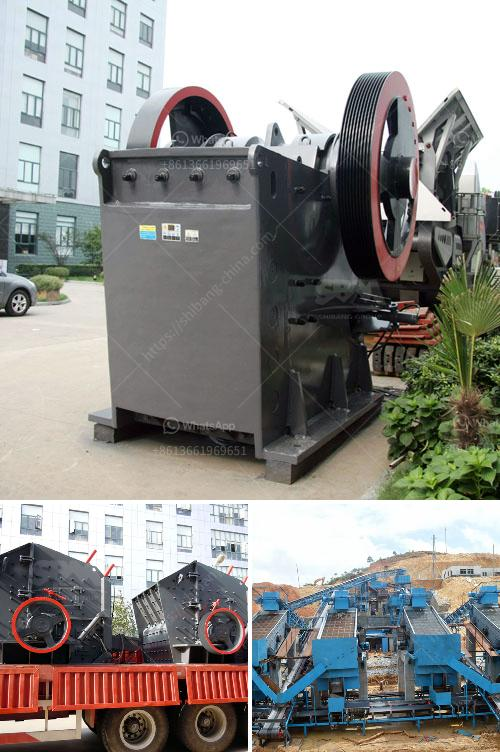

<h3>materials for zenith jaw crusher in europe</h3>
When it comes to crushing rocks and ores, industries across Europe rely on Zenith jaw crushers. These highly efficient machines are renowned for their durability, reliability, and high performance. However, the success of a jaw crusher largely depends on the materials used to construct its components. In this article, we will discuss the primary materials used in the manufacturing process of Zenith jaw crushers in Europe.

First and foremost, the core material used for the construction of jaw plates, known as the crushing liner, plays a vital role in the overall crusher performance. Typically, the jaw plates are made from manganese steel due to its exceptional hardness and toughness. Manganese steel is capable of withstanding immense pressure and impact, making it perfect for crushing applications. Its properties include high wear resistance, which ensures a prolonged lifespan of the jaw plates, reducing maintenance costs.

Another crucial material used in the manufacturing process is high-quality cast steel. Cast steel is employed to construct the mainframe of the jaw crusher, as it provides robustness and strength to endure heavy-duty operations. This material possesses a high tensile strength and is resistant to wear and tear. Moreover, cast steel assists in withstanding the enormous forces generated during the crushing process, maintaining the structural integrity of the machine.

Furthermore, the conveyor belts used in Zenith jaw crushers are typically made from reinforced rubber to ensure durability and flexibility. Reinforced rubber possesses excellent tensile strength, allowing it to transport heavy loads without stretching or breaking. It also has good resistance against abrasion and impact, guaranteeing a longer service life for the conveyor belts.

Lastly, ensuring the overall stability and smooth operation of the jaw crusher are the chosen materials for the eccentric shaft and bearings. The eccentric shaft is usually made of high-grade forged steel, providing stability and strength to handle the heavy loads. The bearings, on the other hand, are commonly made of high-quality anti-friction alloys. These alloys reduce friction between moving parts, preventing wear and heat generation while enabling smooth rotation.

In conclusion, the materials used in Zenith jaw crushers in Europe are carefully selected to ensure superior performance, durability, and reliability. From the crushing liner to the mainframe, from the conveyor belts to the eccentric shaft and bearings, each component plays a crucial role in delivering exceptional crushing capabilities. By utilizing materials such as manganese steel, cast steel, reinforced rubber, and high-grade alloys, Zenith manufactures jaw crushers that are capable of withstanding the harshest conditions and delivering optimal results for various crushing applications.
<h3>Contact us</h3><ul><li><strong>Whatsapp:&nbsp;<a href="https://wa.me/8613661969651">+8613661969651</a></strong></li><li><a href="https://swt.shibang-china.com/?git&amp;zhl&amp;materials for zenith jaw crusher in europe"><strong>Online Service(chat now)</strong></a></li></ul><h3>Related</h3><ul><li><a href='diameter of the ball mill.md'>diameter of the ball mill</a></li><li><a href='grinding machine for gypsum powder.md'>grinding machine for gypsum powder</a></li><li><a href='quartz powder making machine in andhra pradesh.md'>quartz powder making machine in andhra pradesh</a></li><li><a href='mobile crushing station philippines.md'>mobile crushing station philippines</a></li><li><a href='bush crusher machine.md'>bush crusher machine</a></li></ul>