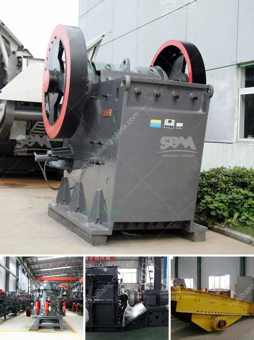

<h3>materials vibrating feeder</h3>
A vibrating feeder is a device used to transfer bulk materials in a controlled manner. It works by vibrating the material along a trough to a desired destination, such as a conveyor belt or stockpile. This equipment has become an essential tool in various industries, including mining, construction, and agriculture, due to its efficient and reliable performance.

One of the key benefits of a vibrating feeder is its ability to handle a wide range of materials. Whether it is stones, aggregates, coal, or chemicals, this equipment can effectively transport them with ease. The design of the feeder allows for a uniform flow of materials, preventing any blockages or uneven distribution.

The vibrating feeder operates by using electromagnetic vibrators or mechanical vibrators. These vibrators create vibrations that help move the material forward. The amplitude and frequency of the vibrations can be adjusted to suit the specific requirements of the application. This ensures that the material is moved at an optimum rate, preventing any damage or overload.

Another advantage of using a vibrating feeder is its energy efficiency. Unlike other types of material transfer systems, such as conveyors or bucket elevators, a vibrating feeder does not require significant amounts of power. The vibrating motion generated by the equipment is enough to propel the materials forward, reducing energy consumption and cost.

In addition, a vibrating feeder is highly versatile and adaptable to different working conditions. Whether it is operating in a dusty environment or handling abrasive materials, this equipment can withstand harsh conditions and continue to function effectively. This makes it an ideal choice for industries where durability and reliability are crucial.

To conclude, a vibrating feeder is a valuable tool when it comes to material handling. Its ability to transfer bulk materials smoothly and efficiently, irrespective of their nature, makes it an indispensable piece of equipment in various industries. Moreover, its energy efficiency and adaptability to different working conditions further enhance its appeal.
<h3>Contact us</h3><ul><li><strong>Whatsapp:&nbsp;<a href="https://wa.me/8613661969651">+8613661969651</a></strong></li><li><a href="https://swt.shibang-china.com/?git&amp;zhl&amp;materials vibrating feeder"><strong>Online Service(chat now)</strong></a></li></ul><h3>Related</h3><ul><li><a href='formula for belt conveyor tonne per hour.md'>formula for belt conveyor tonne per hour</a></li><li><a href='enquiry about impact crusher.md'>enquiry about impact crusher</a></li><li><a href='micro powder mill cost.md'>micro powder mill cost</a></li><li><a href='quarry plant machinery.md'>quarry plant machinery</a></li><li><a href='cement production process.md'>cement production process</a></li></ul>