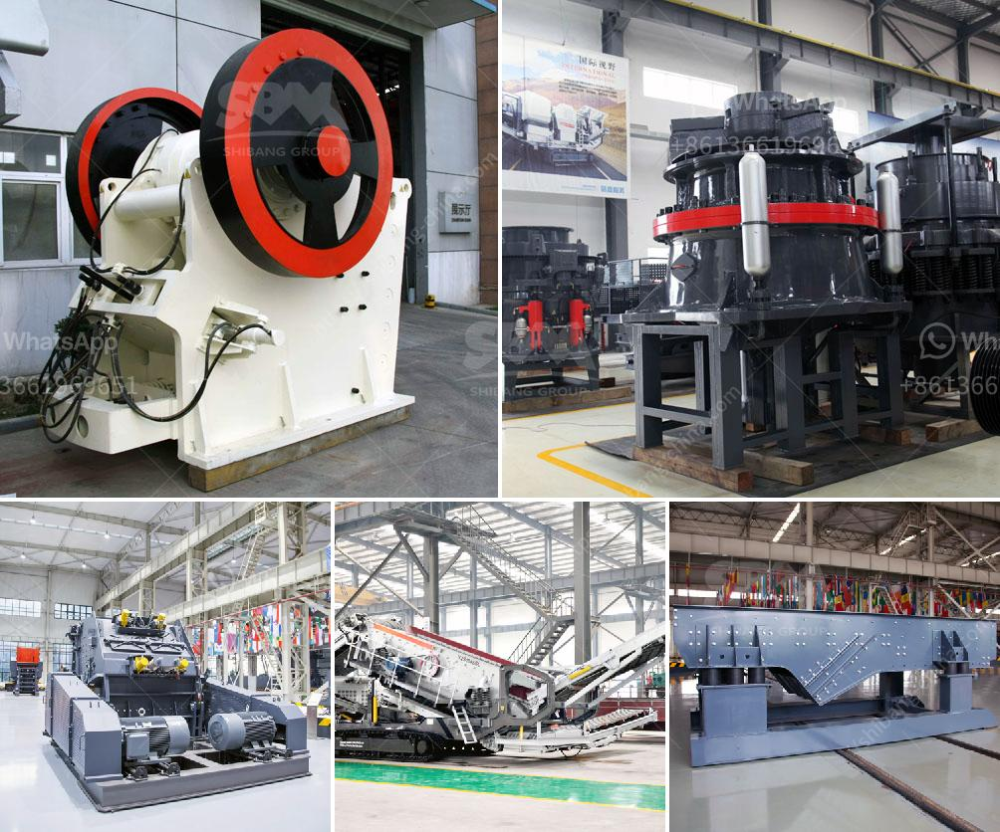

<h3>medium jaw crusher gold mill for sale</h3>
A jaw crusher is an important machine in a crushing plant. It can handle various materials, such as granite, limestone, basalt, shale, river stone, bluestone, sandstone, calcium carbide, iron ore, cooper ore, steel slag, etc. It has a wide range of applications in mining, metallurgy, construction, highway, railway, water conservancy, chemical industries, and many other sectors.

When it comes to gold mill for sale, a medium-sized jaw crusher plays a crucial role. It is the first step in the gold ore crushing process. The jaw crusher breaks large gold-bearing rocks into smaller pieces that will be further processed by other machinery. This improves the efficiency and effectiveness of gold extraction and processing.

A medium-sized jaw crusher is more suitable for gold ore crushing. The jaw crusher is designed with a deep V-shaped crushing chamber, which significantly improves the processing capacity of the machine. This chamber ensures the materials can be evenly crushed, reducing the possibility of blockage and improving the overall crushing efficiency.

In addition, the medium jaw crusher is designed with a wedge discharge opening adjustment device. This device allows the user to adjust the size of the discharge opening easily. By changing the size of the opening, the user can control the final product size and improve the flexibility of the machine.

The medium jaw crusher gold mill for sale is also equipped with a hydraulic system. This system allows the machine to automatically adjust the discharge opening to prevent damage caused by overload or foreign objects. It provides a higher level of reliability and safety during operation.

When choosing a medium jaw crusher gold mill for sale, it is important to consider the machine's power consumption and operating costs. A high-quality machine should be energy-efficient and require minimum maintenance. This will reduce the overall operating costs and increase the profitability of the gold mill.

Another factor to consider is the machine's durability. A medium jaw crusher gold mill for sale should be made of high-quality materials that can withstand the harsh conditions of gold ore processing. It should have a robust construction and be able to handle heavy-duty applications.

There are many manufacturers and suppliers of medium jaw crusher gold mill for sale in the market. It is important to choose a reputable and reliable supplier that offers high-quality machines at competitive prices. A reliable supplier will provide excellent after-sales service, including installation, training, and maintenance support.

In conclusion, a medium jaw crusher gold mill for sale is an essential machine in gold ore crushing and processing. It improves the efficiency and effectiveness of gold extraction and processing. When choosing a medium jaw crusher gold mill, consider factors such as power consumption, operating costs, durability, and the reputation of the supplier. With the right machine, you can maximize the productivity and profitability of your gold mill.
<h3>Contact us</h3><ul><li><strong>Whatsapp:&nbsp;<a href="https://wa.me/8613661969651">+8613661969651</a></strong></li><li><a href="https://swt.shibang-china.com/?git&amp;zhl&amp;medium jaw crusher gold mill for sale"><strong>Online Service(chat now)</strong></a></li></ul><h3>Related</h3><ul><li><a href='grinding ball mill price.md'>grinding ball mill price</a></li><li><a href='equipment for ferro manganese plant.md'>equipment for ferro manganese plant</a></li><li><a href='tertiary impact crushers for quartz.md'>tertiary impact crushers for quartz</a></li><li><a href='quartz crushers price in india.md'>quartz crushers price in india</a></li><li><a href='fastest gold hammer mill in china.md'>fastest gold hammer mill in china</a></li></ul>