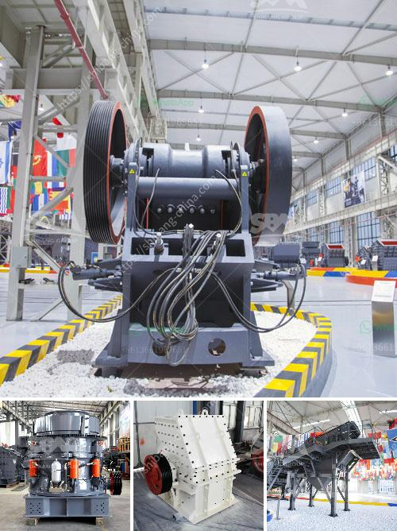

<h3>metal crusher for rent</h3>
When it comes to disposing of your scrap metal, renting a metal crusher can make the process much easier. Instead of hauling your scrap metal to a recycling center or landfill, renting a metal crusher provides you with the convenience and efficiency needed to process and dispose of your metal waste on-site.

A metal crusher, also known as a scrap crusher, is a machine that crushes waste metal to create reusable metal resources. These machines can effectively process both ferrous and non-ferrous metals, such as aluminum, copper, brass, cast iron, and more. With a metal crusher for rent, you can maximize your recycling efforts and ensure that your metals are properly sorted, crushed, and prepared for recycling.

One of the major advantages of renting a metal crusher is the cost-effective nature of the solution. Owning a metal crusher can be a significant investment, and if you do not have a consistent need for crushing metal waste, renting one makes more sense financially. Renting a metal crusher allows you to pay for the duration of the rental period, saving you from the burden of maintenance, repair, and the capital investment required to own a machine.

Furthermore, renting a metal crusher eliminates the need for transportation or outsourcing of your scrap metal disposal. By having the crusher on-site, you can easily process your metal waste as it is generated, saving you time, money, and resources. This also eliminates the risk of your metals getting mixed with other waste materials during transportation or handling.

Another significant advantage of renting a metal crusher is the versatility it offers. These machines come in various sizes and configurations to accommodate different types and quantities of metal waste. Some metal crushers are equipped with features like magnetic separators or conveyor belts to automate the sorting and separation process. This allows you to customize your metal crushing operation to fit your specific requirements, ensuring efficient and effective recycling.

Renting a metal crusher is a straightforward process. Many equipment rental companies offer metal crushers for rent, and they can guide you through the rental process, suggest the appropriate machine based on your needs, and provide any necessary training or support. Additionally, they can also offer maintenance and repair services during the rental period, ensuring that your rented machine operates seamlessly throughout the duration of your project.

To conclude, if you have a need for crushing and recycling metal waste, renting a metal crusher can be a cost-effective and efficient solution. By having the crusher on-site, you can easily process your scrap metal, save money on transportation costs, and ensure that your metals are properly sorted and prepared for recycling. Whether you are a small business, contractor, or homeowner, renting a metal crusher helps you do your part in reducing landfill waste and preserving valuable resources.
<h3>Contact us</h3><ul><li><strong>Whatsapp:&nbsp;<a href="https://wa.me/8613661969651">+8613661969651</a></strong></li><li><a href="https://swt.shibang-china.com/?git&amp;zhl&amp;metal crusher for rent"><strong>Online Service(chat now)</strong></a></li></ul><h3>Related</h3><ul><li><a href='medium jaw crusher gold mill for sale.md'>medium jaw crusher gold mill for sale</a></li><li><a href='small stone crusher supplier in the philippines.md'>small stone crusher supplier in the philippines</a></li><li><a href='stone crusher for sale in south africa.md'>stone crusher for sale in south africa</a></li><li><a href='talcum powder bp usp manufacturers in india.md'>talcum powder bp usp manufacturers in india</a></li><li><a href='vertical roller mill for cement.md'>vertical roller mill for cement</a></li></ul>