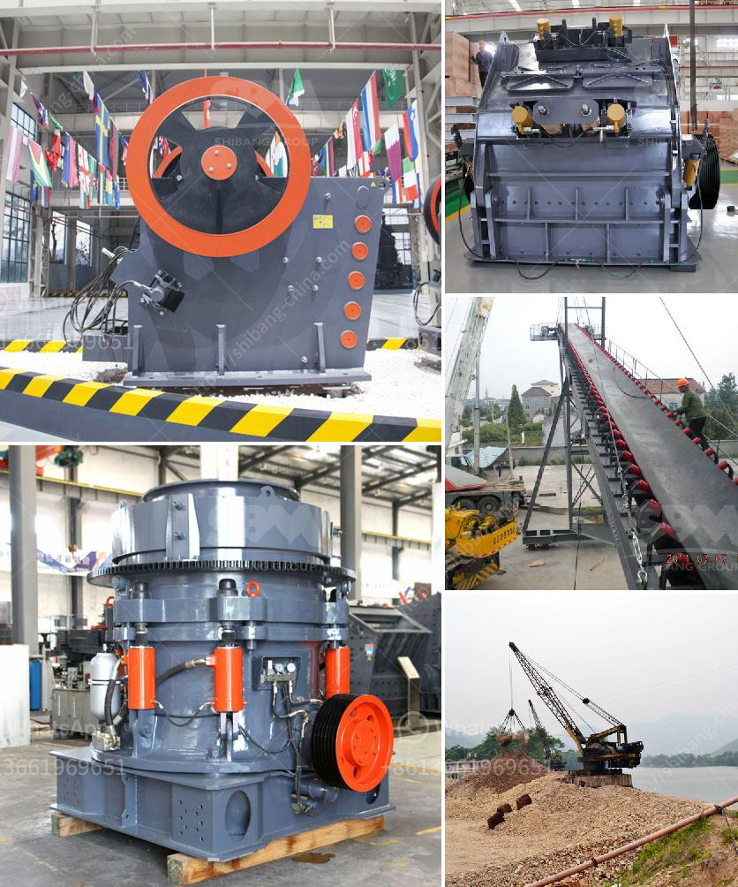

<h3>metal crusher machine for rent in sri lanka</h3>
In today's fizzy marketplace, even little businesses need access to rugged and reliable equipment to ensure their success. With this in mind, the prospect of renting a metal crusher machine should come as no surprise. Metal crushers are a fundamental component of Sri Lanka's quarry and mining industry before they are sent to the construction sector.

Metal crusher machines are notorious for generating loud noise, and causing adverse environmental effects like rainwater contamination, which jeopardizes the quality of living. Hence, renting a metal crusher machine would be the most feasible and valuable avenue to pursue.

Investing in a metal crusher machine to purchase outright might cost you a fortune. However, renting one can be a significantly cost-effective alternative. It allows you to have access to the machinery without making a huge upfront investment, which is especially beneficial for smaller businesses or those with limited budgets.

Renting a metal crusher machine provides you with the freedom and flexibility to choose the equipment that best suits your project's needs. You can select from a wide variety of machines with various capacities, allowing you to tackle different projects with ease. This versatility is especially crucial in Sri Lanka's ever-changing construction industry.

The construction and quarry industries are continually evolving, adapting to the latest technological advancements. By choosing to rent a metal crusher machine, you ensure that you have access to the most up-to-date technology and equipment. This allows you to enhance the efficiency and productivity of your operations, leaving your competitors behind.

One of the most significant advantages of renting a metal crusher machine is that you can remove the burden of maintenance and repair from your shoulders. When you rent equipment, the rental company typically handles routine maintenance and repairs. This relieves you of any additional costs and responsibilities, allowing you to focus solely on your project.

Sri Lanka, known for its abundant natural resources and flourishing construction industry, clearly benefits from the metal crusher machine for rent concept. It complements the country's growth by providing an alternative option for metal waste management. With a growing number of customers looking for a sustainable and economical solution, renting a metal crusher machine should be considered by business owners.

In conclusion, renting a metal crusher machine offers a cost-effective, flexible, and environmentally friendly solution for the construction and mining industries. With Sri Lanka's construction sector expanding rapidly, owning a metal crusher machine is a profitable venture that provides continuous returns. So, get started on your next construction project with a metal crusher machine for rent and propel your business to new heights.
<h3>Contact us</h3><ul><li><strong>Whatsapp:&nbsp;<a href="https://wa.me/8613661969651">+8613661969651</a></strong></li><li><a href="https://swt.shibang-china.com/?git&amp;zhl&amp;metal crusher machine for rent in sri lanka"><strong>Online Service(chat now)</strong></a></li></ul><h3>Related</h3><ul><li><a href='vertical shaft impact crusher south africa.md'>vertical shaft impact crusher south africa</a></li><li><a href='vertical vertical inspection method.md'>vertical vertical inspection method</a></li><li><a href='how to make unq stone crusher.md'>how to make unq stone crusher</a></li><li><a href='stone crushers in ethiopia.md'>stone crushers in ethiopia</a></li><li><a href='cement production process.md'>cement production process</a></li></ul>