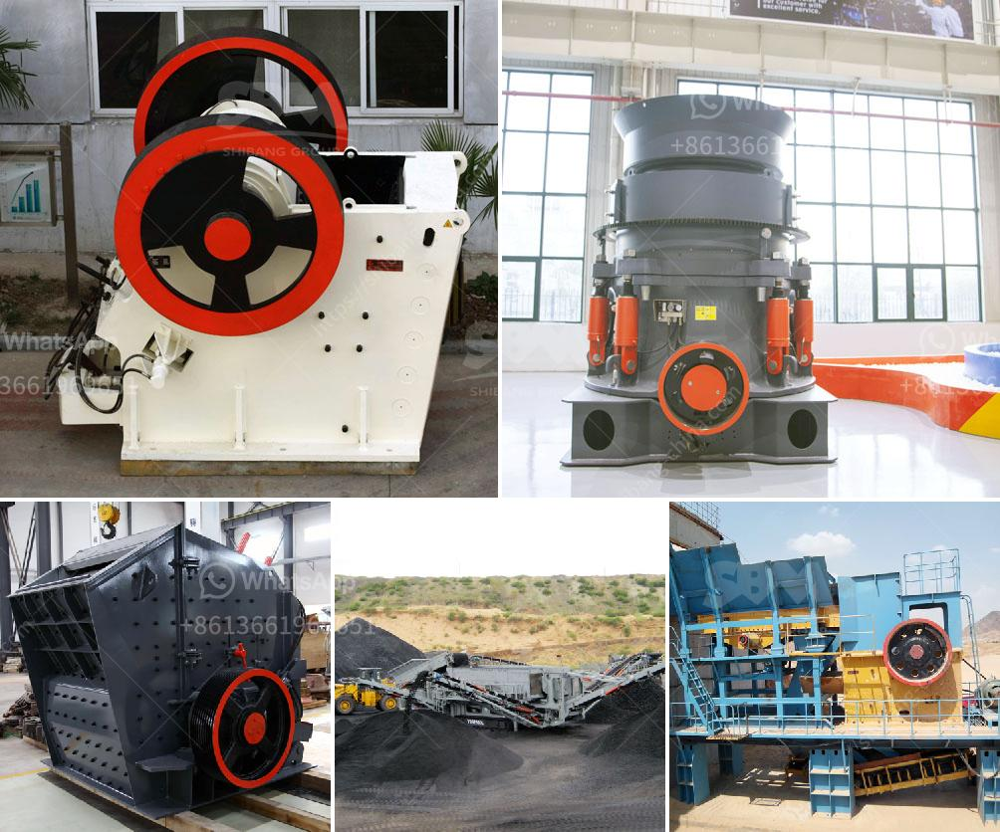

<h3>metal crusher suppliers in sri lanka</h3>
Sri Lanka, an island nation located in the Indian Ocean, is known for its rich biodiversity and natural beauty. However, it is also home to numerous metal crusher suppliers who cater to the growing demand for metal crushers around the country.

Metal crusher suppliers in Sri Lanka offer machines that are capable of crushing a variety of materials to desired specifications. These machines can be operated manually or automatically, depending on the requirements of the customer. Different metal crusher machines are available based on their sizes, motor capacities, and output capacities.

The metal crusher industry in Sri Lanka has been growing rapidly due to its popularity among the construction and mining sectors. The Sri Lankan government has taken steps to regulate the industry and provide guidelines to ensure the safety of workers and the environment.

Metal crusher suppliers in Sri Lanka are focused on providing high-quality machines with maximum efficiency and durability. Their metal crushers are designed to meet the specific needs of customers and can be customized to achieve the desired output. These suppliers also ensure timely delivery and provide after-sales support to their customers.

Metal crusher suppliers in Sri Lanka also offer highly competitive prices for their machines, which are extremely cost-effective. These machines help reduce the size of metal waste and make it easier for disposal or recycling. The crushers provide a convenient and economical way to crush metal materials and prevent them from being dumped in landfills, contributing to a cleaner and greener environment.

In conclusion, metal crusher suppliers in Sri Lanka offer an array of machines for various material crushing purposes. They provide efficient and reliable solutions to cater to the growing demand in the construction and mining sectors. With their commitment to quality and customer satisfaction, these suppliers play a crucial role in promoting sustainable practices and environmental conservation in Sri Lanka.
<h3>Contact us</h3><ul><li><strong>Whatsapp:&nbsp;<a href="https://wa.me/8613661969651">+8613661969651</a></strong></li><li><a href="https://swt.shibang-china.com/?git&amp;zhl&amp;metal crusher suppliers in sri lanka"><strong>Online Service(chat now)</strong></a></li></ul><h3>Related</h3><ul><li><a href='cement stone crusher for sale.md'>cement stone crusher for sale</a></li><li><a href='coal powder making.md'>coal powder making</a></li><li><a href='mobile crushing and screening manufacturer in india.md'>mobile crushing and screening manufacturer in india</a></li><li><a href='stone crusher plant cost in saudi.md'>stone crusher plant cost in saudi</a></li><li><a href='metal crusher suppliers in sri lanka.md'>metal crusher suppliers in sri lanka</a></li></ul>