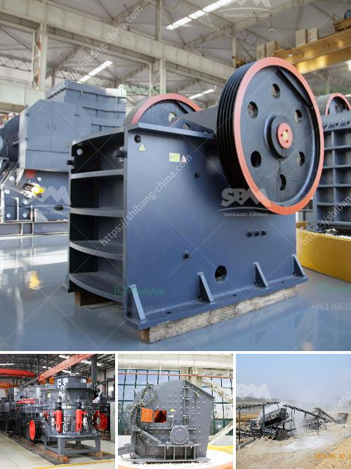

<h3>mica grinding mill</h3>
Mica is a mineral resource with various applications both in industrial and cosmetic fields. It is widely used in paints, plastics, rubber, ceramics, cosmetics, insulation materials, fireproof materials, and so on. To meet the demands of mica powder, it requires efficient and reliable grinding equipment. The mica grinding mill is an essential machine for mica processing.

The mica grinding mill can be divided into three types: mica vertical grinding mill, mica trapezium grinding mill, and mica ultrafine grinding mill. In the mica grinding mill, the fineness of the finished product can be adjusted arbitrarily between 325-3000 mesh. You can choose suitable mica grinding mill according to your requirements.

The structure of mica grinding mill is simple, compact, and small in size. It is composed of the main machine, grinding roller device, grinding ring device, and motor. It adopts a sealed design and has no dust pollution during operation. The equipment runs steadily, with high efficiency, low energy consumption, and high output. It can effectively reduce production costs and bring considerable benefits to users.

The mica grinding mill adopts a curved blade design, which effectively increases the contact area of the material and the grinding roller and improves the grinding efficiency. The grinding roller and grinding ring are made of wear-resistant materials, which are durable and have a longer service life. The grinding roller can be turned out of the mill for easy maintenance and replacement.

In addition, the mica grinding mill has a variety of auxiliary devices, such as a storage bin, a vibrating feeder, a bucket elevator, an electromagnetic vibrating feeder, and an electric control cabinet. These devices work together to form a complete mica grinding production line, which can realize automatic production and save labor costs.

When using the mica grinding mill, it is necessary to carry out regular maintenance and maintenance to reduce wear on the equipment and extend its service life. The lubrication of the grinding roller bearing is an important part of the maintenance work. It is necessary to add lubricating oil regularly to ensure the normal operation of the bearing.

In conclusion, the mica grinding mill is an ideal equipment for grinding mica. It has the characteristics of high grinding efficiency, low energy consumption, and low maintenance cost. It is widely used in the mica processing industry and brings considerable economic benefits to users. If you are interested in mica grinding mill, please contact us and we will provide you with professional technical support and excellent service.
<h3>Contact us</h3><ul><li><strong>Whatsapp:&nbsp;<a href="https://wa.me/8613661969651">+8613661969651</a></strong></li><li><a href="https://swt.shibang-china.com/?git&amp;zhl&amp;mica grinding mill"><strong>Online Service(chat now)</strong></a></li></ul><h3>Related</h3><ul><li><a href='cost of setting up a quarry crusher plant.md'>cost of setting up a quarry crusher plant</a></li><li><a href='cost for small cement plant setup.md'>cost for small cement plant setup</a></li><li><a href='mobile crusher ghana.md'>mobile crusher ghana</a></li><li><a href='hammer milling disadvantages.md'>hammer milling disadvantages</a></li><li><a href='mining tenders in south africa.md'>mining tenders in south africa</a></li></ul>