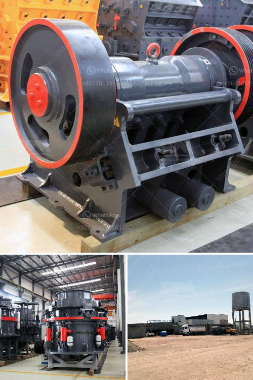

<h3>mica powder manufacturing process</h3>
Mica powder is a versatile material that has numerous applications in various industries, including cosmetics, paints, plastics, ceramics, and electronics. It is derived from the mineral mica, which is a group of complex silicate minerals known for their natural shimmer and luster.

The manufacturing process of mica powder involves several stages to transform raw mica ore into a fine powder suitable for different industrial uses. Here is a step-by-step guide to understanding the manufacturing process of mica powder:

1. Mining: The first step in the manufacturing process is extracting mica ore from mines or quarries. Mica deposits can be found worldwide, but the largest reserves are located in India, followed by China.

2. Sorting and Grading: Once the mica ore is extracted, it undergoes sorting and grading processes to separate impurities and ensure a consistent quality of the mica flakes. This involves manually sorting the ore based on color, size, and quality.

3. Cleaning: The sorted mica flakes are then thoroughly cleaned to remove any impurities such as dust, clay, or other minerals. Several methods are used for cleaning, including washing, scrubbing, and magnetic separation.

4. Crushing and Grinding: After cleaning, the mica flakes are crushed and ground into smaller particles using various crushing and grinding equipment. This process reduces the size of the flakes, resulting in a fine powder form.

5. Wet Grinding: In some cases, wet grinding techniques are used to further refine the mica powder and enhance its properties. This method involves grinding the mica flakes in water, which helps in reducing particle size and improving the purity and brightness of the powder.

6. Drying: The wet mica powder obtained from the previous step is then dried using specialized drying equipment. This process removes the excess moisture and ensures that the mica powder is free-flowing and easy to handle.

7. Sieving/Filtering: The dried mica powder is sieved or filtered to obtain a uniform particle size distribution. This step removes any oversized particles or impurities, ensuring that the final product meets the desired specifications.

8. Packaging: Finally, the mica powder is packaged in suitable containers or bags, ready for distribution and sale. The packaging process is often automated to maintain hygiene and prevent contamination of the powder.

It is important to note that the manufacturing process of mica powder may vary slightly depending on the specific requirements of the end-use application. Some additional treatments, such as surface coating or treatment with functional additives, may be applied to enhance the properties of the mica powder.

In conclusion, the manufacturing process of mica powder involves various stages, including mining, sorting and grading, cleaning, crushing and grinding, wet grinding, drying, sieving/filtering, and packaging. This meticulous process ensures the production of high-quality mica powder suitable for a wide range of industrial applications.
<h3>Contact us</h3><ul><li><strong>Whatsapp:&nbsp;<a href="https://wa.me/8613661969651">+8613661969651</a></strong></li><li><a href="https://swt.shibang-china.com/?git&amp;zhl&amp;mica powder manufacturing process"><strong>Online Service(chat now)</strong></a></li></ul><h3>Related</h3><ul><li><a href='crushers price in south africa product.md'>crushers price in south africa product</a></li><li><a href='business plan of silica sand crusher factory.md'>business plan of silica sand crusher factory</a></li><li><a href='industrial conveyor belts dimensions.md'>industrial conveyor belts dimensions</a></li><li><a href='suppliers conveyor belts celaya.md'>suppliers conveyor belts celaya</a></li><li><a href='uk made stone crushing machine.md'>uk made stone crushing machine</a></li></ul>