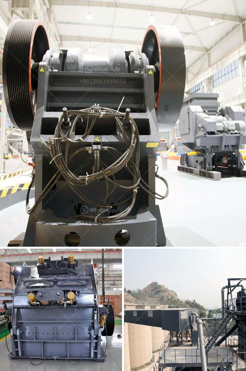

<h3>micro powder mill cost</h3>
Micro powder mills are innovative milling devices that are becoming increasingly popular in the industrial sector. These mills are capable of producing ultra-fine powders, making them ideal for a wide range of industries, including mining, metallurgy, cement production, and chemical engineering.

One of the key factors that entrepreneurs and businesses consider when investing in a micro powder mill is the cost. The cost of a micro powder mill can vary based on various factors, such as the mill's capacity, technology, and manufacturer. In this article, we will explore the cost of micro powder mills and factors that affect their price.

The capacity of a micro powder mill is one of the most significant factors that determine its cost. Higher capacity mills generally have a higher price tag. Micro powder mills with larger capacities can process a larger amount of materials, resulting in higher production rates. However, it is crucial first to evaluate the requirements of your business to determine the appropriate capacity needed. Investing in a micro powder mill with a higher capacity than necessary can lead to unnecessary expenses.

The technology used in a micro powder mill can also impact its cost. Advanced technologies, such as pressure micro-powder grinding, are more expensive than mills that use simpler mechanisms. However, mills with advanced technologies often offer enhanced performance and efficiency, resulting in higher quality and better output. Therefore, it is recommended to assess the level of technology needed for your applications to strike a balance between cost and performance.

Choosing a reputable and reliable manufacturer is essential when considering the cost of a micro powder mill. Reputable manufacturers often offer higher quality mills that provide better performance and durability. While their prices might be slightly higher, they generally provide better long-term value and customer support. Additionally, reputable manufacturers often offer warranty packages that can provide additional peace of mind for the buyer.

Another aspect that affects the cost of micro powder mills is the availability of spare parts and maintenance services. It is crucial to select a mill that comes with readily available spare parts as this can significantly impact the maintenance and repair costs. Additionally, consider manufacturers that offer comprehensive maintenance and repair services to minimize downtime and ensure the longevity of your micro powder mill.

In conclusion, the cost of a micro powder mill can vary based on factors such as capacity, technology, manufacturer, spare parts availability, and maintenance services. It is essential to carefully evaluate your business requirements and budget to determine the appropriate micro powder mill for your needs. Investing in a high-quality mill from a reputable manufacturer might involve a higher initial cost but can offer better long-term value and performance.
<h3>Contact us</h3><ul><li><strong>Whatsapp:&nbsp;<a href="https://wa.me/8613661969651">+8613661969651</a></strong></li><li><a href="https://swt.shibang-china.com/?git&amp;zhl&amp;micro powder mill cost"><strong>Online Service(chat now)</strong></a></li></ul><h3>Related</h3><ul><li><a href='complete crushing plant.md'>complete crushing plant</a></li><li><a href='i want to buy a quarry machine nigeria.md'>i want to buy a quarry machine nigeria</a></li><li><a href='mobile crusher price malaysia.md'>mobile crusher price malaysia</a></li><li><a href='crushers discarded stone crusher.md'>crushers discarded stone crusher</a></li><li><a href='coal powder making.md'>coal powder making</a></li></ul>