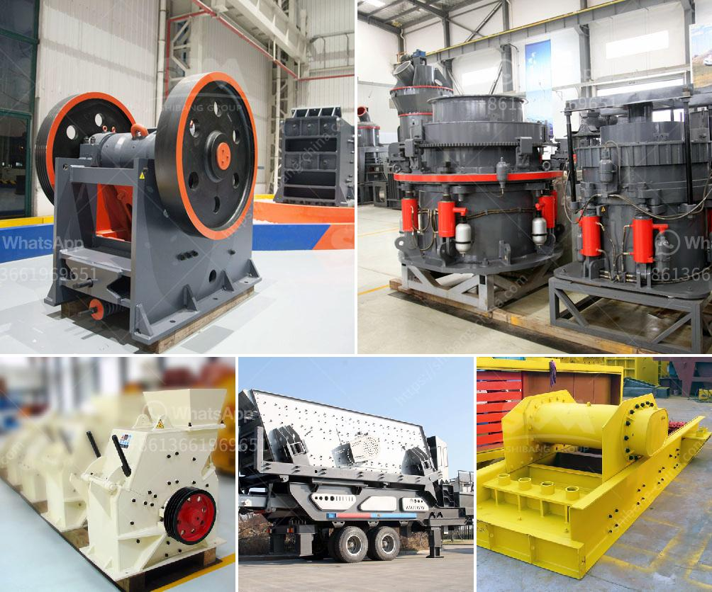

<h3>micron grinding unit menufacture plant in bewar</h3>
In the world of manufacturing, precision plays a pivotal role in ensuring the quality and durability of products. One essential aspect of this process is micron grinding, an advanced technique used to achieve ultra-fine particle size in various materials. Bewar, a small industrial town in Uttar Pradesh, is home to a cutting-edge micron grinding unit manufacturing plant that specializes in delivering top-notch grinding solutions.

This state-of-the-art plant employs advanced machinery and techniques to manufacture micron grinding units that are second to none in terms of precision and performance. With a team of highly skilled engineers and technicians, the plant ensures that each micron grinding unit that rolls out of its production line meets the highest quality standards.

The micron grinding units manufactured in this plant are utilized in a wide range of industries, including pharmaceuticals, chemicals, food processing, and many more. These units are designed to effectively grind materials to particle sizes as small as one micron, making them ideal for applications that require utmost precision. Whether it's grinding powders, minerals, or pigments, the micron grinding units from this plant deliver exceptional results.

What sets this micron grinding unit manufacturing plant apart is its commitment to continuous innovation, research, and development. The plant strives to stay at the forefront of technological advancements in the field of micron grinding, incorporating the latest tools and techniques into its manufacturing process. This ensures that customers receive grinding units that are not only highly efficient but also cater to their specific requirements.

Furthermore, this plant adheres to strict quality control measures at every step of the manufacturing process. From selecting the finest raw materials to conducting thorough quality checks on the finished products, the plant leaves no stone unturned in ensuring the reliability and durability of its micron grinding units.

In addition to manufacturing, the plant also offers comprehensive after-sales support. A dedicated team of customer service professionals and technicians is always ready to assist clients with any queries or concerns they may have regarding the functioning or maintenance of the grinding units. This commitment to customer satisfaction has earned the plant a loyal clientele that spans national and international boundaries.

Overall, the micron grinding unit manufacturing plant in Bewar stands as a testament to India's expertise in the field of precision engineering. With its focus on cutting-edge technology, quality control, and customer support, the plant continues to provide top-notch micron grinding units that set new benchmarks in the manufacturing industry.

In conclusion, the existence of the micron grinding unit manufacturing plant in Bewar is a boon for industries seeking high precision grinding solutions. With its advanced manufacturing techniques, commitment to innovation, and outstanding customer support, this plant has established itself as a pioneer in the field, cementing India's position in the global manufacturing landscape.
<h3>Contact us</h3><ul><li><strong>Whatsapp:&nbsp;<a href="https://wa.me/8613661969651">+8613661969651</a></strong></li><li><a href="https://swt.shibang-china.com/?git&amp;zhl&amp;micron grinding unit menufacture plant in bewar"><strong>Online Service(chat now)</strong></a></li></ul><h3>Related</h3><ul><li><a href='mica grinding mill.md'>mica grinding mill</a></li><li><a href='crusher in coal mining.md'>crusher in coal mining</a></li><li><a href='slag grinding process.md'>slag grinding process</a></li><li><a href='rock crusher used in mining and quarry for sale.md'>rock crusher used in mining and quarry for sale</a></li><li><a href='grinding mill machines in south africa.md'>grinding mill machines in south africa</a></li></ul>