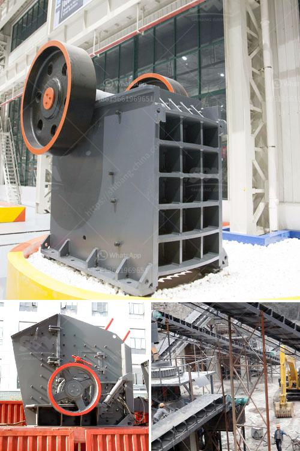

<h3>mill crusher pigment manufacturer in kenya</h3>
Kenya, located in the eastern region of Africa, is known for its abundant natural resources and vibrant economy. One of the key industries thriving in the country is the manufacturing sector, which has seen significant growth in recent years. Among the various manufacturing segments, the mill crusher pigment industry in Kenya has emerged as a prominent sector.

A mill crusher pigment manufacturer is responsible for producing finely ground pigments used in various industries such as paints, coatings, plastics, textiles, and ceramics. These pigments are essential for giving color, durability, and protection to the end products. The manufacturing process involves crushing and grinding raw materials, which are then transformed into fine powders through specialized mills and crushers. The finely ground pigments are then carefully packaged and distributed for sale.

In Kenya, several companies have established themselves as reliable mill crusher pigment manufacturers. These companies invest heavily in advanced machinery and equipment to ensure the production of high-quality pigments that meet international standards. They also employ skilled technicians and engineers who are adept at operating and maintaining the machinery, guaranteeing efficient production processes. Furthermore, these manufacturers prioritize sustainable practices, adhering to strict environmental regulations and promoting responsible waste management.

The mill crusher pigment industry in Kenya has experienced significant growth due to the country's vibrant economy and the increasing demand for pigments both domestically and internationally. Kenya's strategic location makes it an ideal base for exporting pigments to neighboring African countries and beyond. The industry also benefits from Kenya's stable political environment and business-friendly policies, which attract foreign investments and foster partnerships with international manufacturers.

In conclusion, the mill crusher pigment industry in Kenya is thriving, thanks to the presence of dedicated manufacturers who prioritize quality, sustainability, and innovation. With the country's favorable business environment and growing market demand, this sector is expected to continue flourishing, contributing to Kenya's overall economic growth and development.
<h3>Contact us</h3><ul><li><strong>Whatsapp:&nbsp;<a href="https://wa.me/8613661969651">+8613661969651</a></strong></li><li><a href="https://swt.shibang-china.com/?git&amp;zhl&amp;mill crusher pigment manufacturer in kenya"><strong>Online Service(chat now)</strong></a></li></ul><h3>Related</h3><ul><li><a href='silica grinding machine manufacturer.md'>silica grinding machine manufacturer</a></li><li><a href='beneficiation plant process line diagram.md'>beneficiation plant process line diagram</a></li><li><a href='different types of vibrating screen.md'>different types of vibrating screen</a></li><li><a href='kaolin processing machinery.md'>kaolin processing machinery</a></li><li><a href='stone crushing plant in pakistan.md'>stone crushing plant in pakistan</a></li></ul>