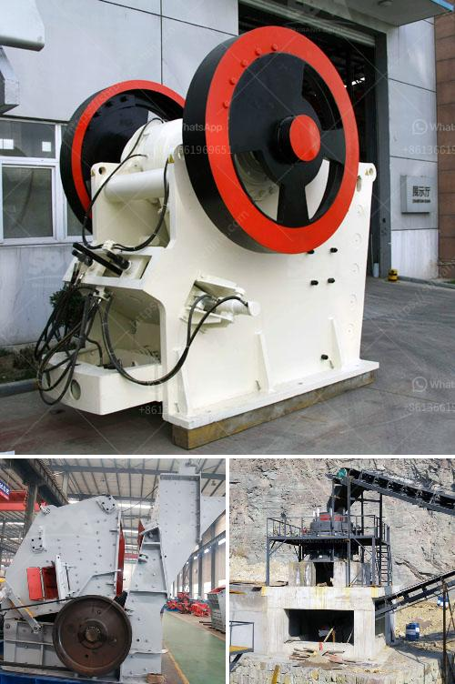

<h3>mill prices and for sale sri lanka</h3>
Sri Lanka, known for its picturesque landscapes and vibrant culture, has also been making significant strides in its economic development. The agriculture sector, which forms the backbone of the country's economy, has seen a considerable increase in productivity, especially in the field of mill prices and sales.

One of the primary reasons for this growth is the focus on modernizing the traditional milling industry. Sri Lanka is heavily reliant on rice production, and therefore, milling holds significant importance in the agricultural process. Traditional milling methods involve time-consuming and labor-intensive processes, leading to relatively higher prices and lower productivity.

To overcome these challenges, the Sri Lankan government has undertaken various initiatives to update and upgrade the milling industry. The introduction of modern milling technologies has not only increased efficiency but has also resulted in reduced milling prices. These advancements have made it possible for local farmers to produce high-quality rice at a more affordable cost.

The implementation of new equipment and machinery has played a crucial role in driving down mill prices. Modern mills utilize advanced technologies such as precision grading systems, color sorters, and automated separating processes. These innovations result in improved quality control and better value for money, both for the mill owners and the consumers. Moreover, the introduction of larger milling capacities has enabled bulk processing, resulting in economies of scale and further price reduction.

Another significant factor contributing to the decline in mill prices is the promotion of competition in the market. The Sri Lankan government has actively encouraged private sector involvement in the milling industry. This has led to increased competition, forcing mill owners to offer competitive prices to attract customers. The presence of multiple players in the market ensures that consumers have more options to choose from, creating a buyer-friendly market environment.

In addition to the domestic market, the surge in mill production has also stimulated export opportunities. Sri Lankan rice, renowned for its superior quality and unique characteristics, has gained popularity in the international market. The increase in mill capacity has allowed exporters to fulfill international demands, resulting in foreign exchange earnings for the country. The combination of lower mill prices and greater production capacity has made Sri Lankan rice more competitive in the global market.

For those interested in investing or purchasing mills in Sri Lanka, there are several avenues available. Online platforms and business directories provide information about mill sales, connecting potential buyers with mill owners. These platforms facilitate the process of finding mills that suit specific requirements in terms of capacity, location, and price. Additionally, engaging with local industry associations and trade organizations can provide invaluable insights and networking opportunities.

As the Sri Lankan milling industry continues to evolve and embrace modernization, the prospects for buyers become increasingly promising. The decrease in mill prices, coupled with improved quality, ensures that customers receive better value for their money. Furthermore, the emphasis on competition and the growth in export opportunities make owning a mill in Sri Lanka a potentially lucrative investment.

In conclusion, the mill prices and sales landscape in Sri Lanka has witnessed significant transformations, primarily driven by technological advancements and competition. The modernization of mills has resulted in lower prices and increased efficiency, benefiting both mill owners and consumers. With the rise in export opportunities and the facilitation of sales through various platforms, investing in mills in Sri Lanka presents an attractive opportunity for buyers looking to capitalize on the country's thriving agricultural sector.
<h3>Contact us</h3><ul><li><strong>Whatsapp:&nbsp;<a href="https://wa.me/8613661969651">+8613661969651</a></strong></li><li><a href="https://swt.shibang-china.com/?git&amp;zhl&amp;mill prices and for sale sri lanka"><strong>Online Service(chat now)</strong></a></li></ul><h3>Related</h3><ul><li><a href='cost of cement factory setup.md'>cost of cement factory setup</a></li><li><a href='quarry plant machinery.md'>quarry plant machinery</a></li><li><a href='ball mill manufacturers south africa.md'>ball mill manufacturers south africa</a></li><li><a href='chromite ore processing in zimbabwe.md'>chromite ore processing in zimbabwe</a></li><li><a href='sell european stone crusher.md'>sell european stone crusher</a></li></ul>