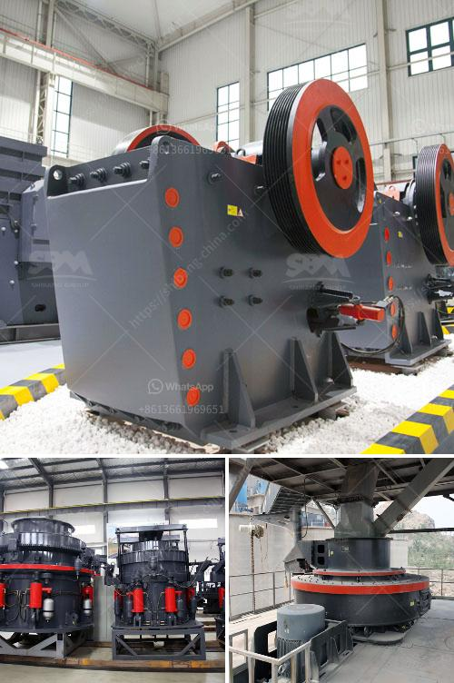

<h3>milling processing for small scale mining</h3>
One of the most lucrative industries in the world is mining, especially for precious metals. With the increasing demand for these metals, miners have been pushed to explore new mining sites, particularly in remote areas. However, large-scale mining operations are not always feasible in these regions due to various constraints, such as limited access to capital, lack of infrastructure, and environmental concerns. As a result, small-scale mining has gained prominence as a viable option for extracting valuable minerals.

Small-scale mining refers to the extraction of minerals using basic tools and techniques, often undertaken by individuals or small groups. While it may seem rudimentary, this approach to mining has its advantages, such as low investment costs and flexibility in terms of operations. However, to ensure efficient and effective ore extraction, small-scale miners must incorporate milling processing into their operations.

Milling processing involves crushing the ore into small particles, which then undergo further processing to extract the valuable minerals. This technique is crucial for small-scale miners as it maximizes the recovery of gold and other precious metals. Moreover, it significantly reduces the amount of harmful chemicals used in the extraction process, thereby promoting environmentally sustainable mining practices.

The first step in milling processing is crushing the ore into smaller pieces. This is typically accomplished through the use of jaw crushers and impact crushers. Jaw crushers are commonly used for primary crushing, while impact crushers are ideal for secondary or tertiary crushing. These crushers break down the ore into manageable sizes, making it easier for further processing.

Once the ore is crushed, it is then subjected to grinding, which is carried out by ball mills or rod mills. The goal of grinding is to reduce the ore to a fine powder, allowing for better mineral extraction. Ball mills are the most commonly used equipment in this stage, as they provide efficient grinding and can handle large quantities of ore.

After grinding, the ore undergoes further treatment through processes such as gravity separation, flotation, or cyanidation. These processes help separate the valuable minerals from the unwanted gangue or impurities. Gravity separation utilizes the differences in density between minerals to separate them, while flotation relies on the differences in surface properties. Cyanidation involves the use of cyanide to dissolve the gold or silver present in the ore.

It is important to note that milling processing requires proper equipment, such as crushers and mills, which may not be readily available for small-scale miners. In such cases, miners can form cooperatives or associations to pool their resources and acquire the necessary equipment collectively. This shared approach not only reduces the financial burden on individual miners but also allows for better utilization of the equipment.

In conclusion, milling processing plays a critical role in small-scale mining operations. It enables miners to extract valuable minerals more efficiently and sustainably, with reduced environmental impact. By incorporating this technique into their operations, small-scale miners can maximize their profits while ensuring responsible mining practices. Collaborative efforts to acquire the necessary equipment further enhance the effectiveness of milling processing, making it an essential technique for small-scale mining.
<h3>Contact us</h3><ul><li><strong>Whatsapp:&nbsp;<a href="https://wa.me/8613661969651">+8613661969651</a></strong></li><li><a href="https://swt.shibang-china.com/?git&amp;zhl&amp;milling processing for small scale mining"><strong>Online Service(chat now)</strong></a></li></ul><h3>Related</h3><ul><li><a href='pebble crusher for sale.md'>pebble crusher for sale</a></li><li><a href='plans for making a miniature jaw crusher.md'>plans for making a miniature jaw crusher</a></li><li><a href='jaw crushers kyrgyzstan.md'>jaw crushers kyrgyzstan</a></li><li><a href='gold refinery equipment china.md'>gold refinery equipment china</a></li><li><a href='from lead ore saparated gold and silver plant.md'>from lead ore saparated gold and silver plant</a></li></ul>