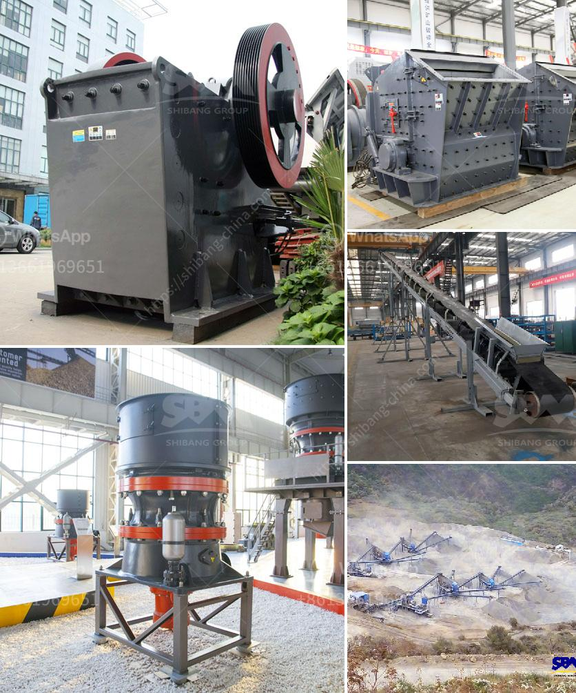

<h3>mineral grinding mill machine used for sale uk</h3>
Grinding mills are widely used in various industries like mining, electric power, metallurgy, chemical, cement, ceramics, paper-making, and other industries. The first-class materials and techniques have been adopted in the production of the grinding machinery. Because of its unique structure, the grinding machine has a long service life and fewer maintenance costs. It is an ideal machinery for mineral grinding.

One of the main applications of the grinding mill machine is grinding of various minerals. In the mining industry, it is used to crush materials into smaller particles for further processing. Grinding mills play a crucial role in mineral processing, helping to reduce the size of ore particles and increase their surface area for better extraction and separation.

The mineral grinding mill machine is widely used in industries such as metallurgy, building materials, chemicals, and mining. It can grind various non-flammable and explosive minerals with Mohs hardness below 7 and humidity less than 6%. The fineness of the finished product can be adjusted between 0.18mm-0.01mm.

The mineral grinding mill machine has the features of strong adaptability, continuous production, large crushing ratio, easy adjustment of the product fineness, and can be widely used in ore dressing, building materials, chemical industry, coal mine, and other industries. It can also be applied to grind materials used in metallurgy, chemical industry, building materials, mining, and other fields.

The mineral grinding mill machine is highly efficient (twice as much as jet mill, mixing grinder and ball mill) while its energy consumption is only one-third of air current mill. High fineness of the finished product and high efficiency make it an ideal equipment in the mineral processing field.

In the UK, there is a high demand for grinding mills, especially in the mineral processing industry. The high-quality mineral grinding mill machine is widely used by local mineral processing factories. But many customers do not have enough money to buy high-quality machines, which is why they choose to buy used grinding machines.

Used grinding mill machines have lower prices than new ones. The used grinding mill machines have limited wear and tear, which means they can be used for a longer time. Compared with new grinding mill machines, used ones save energy consumption by 30-40% and reduce environmental pollution.

There are various types of used grinding mill machines for sale in the UK. According to different grinding principles, grinding mills can be divided into the following types: Raymond mill, high-pressure suspension mill, high-pressure micro powder mill, veritical mill, ball mill, etc. Customers can choose the most suitable grinding mill machine according to their actual needs.

Before buying a used grinding mill machine, customers should consider the following factors: the fineness of the finished product, the production capacity, the installation method, the service life of the grinding rollers and rings, the energy consumption, the maintenance cost, the overall quality of the grinding mill machine, and so on.

Overall, the mineral grinding mill machine is a crucial equipment in the mineral processing industry. It helps to reduce the size of ore particles and increase their surface area for better extraction and separation. In the UK, there is a high demand for high-quality grinding mill machines. By choosing used grinding mill machines, customers can save money and still get high-quality machines.
<h3>Contact us</h3><ul><li><strong>Whatsapp:&nbsp;<a href="https://wa.me/8613661969651">+8613661969651</a></strong></li><li><a href="https://swt.shibang-china.com/?git&amp;zhl&amp;mineral grinding mill machine used for sale uk"><strong>Online Service(chat now)</strong></a></li></ul><h3>Related</h3><ul><li><a href='crusher cost of crusher of jaw.md'>crusher cost of crusher of jaw</a></li><li><a href='recycled concrete manufacturers in shanghai.md'>recycled concrete manufacturers in shanghai</a></li><li><a href='gold crusher in south africa.md'>gold crusher in south africa</a></li><li><a href='small jaw crusher uk.md'>small jaw crusher uk</a></li><li><a href='cost o gypsum processing machines.md'>cost o gypsum processing machines</a></li></ul>