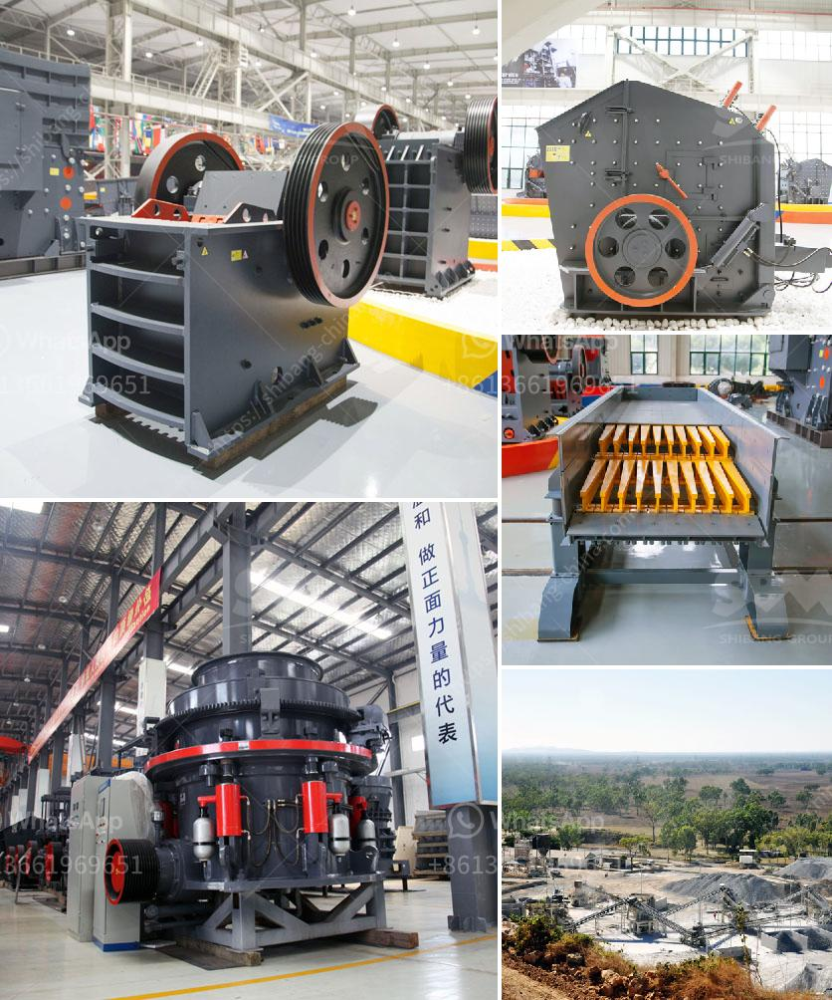

<h3>mineral processing ball mills nigeria</h3>
Nigeria is a country blessed with abundant mineral resources. One of the major challenges faced by industries within the country is the lack of access to processing facilities. However, the advent of the ball mill technology has simplified the process of mineral identification and extraction in Nigeria's mining sector.

Ball mills are designed to grind and mix dry powder samples using balls of different sizes. Its advantageous mechanical properties, including a simple solid structure, impact resistance, and low maintenance requirement, have contributed significantly to its widespread use in mineral processing industries. 

In Nigeria, the mining industry plays a crucial role in the economic development of the country. Mineral resources are predominantly found in the northern parts of Nigeria, including states such as Sokoto, Zamfara, Kebbi, and Kaduna. These regions are not only rich in mineral deposits but also face numerous challenges that hinder the extraction and processing of these minerals.

One of the major challenges faced by miners in Nigeria is the lack of adequate processing facilities. Most of the raw materials mined are exported to other countries for processing, resulting in the loss of revenue and job opportunities within the country. The reliance on foreign processing facilities also hinders technology transfer and limits the growth of the local mining industry.

The advent of the ball mill technology has changed the narrative in the Nigerian mining sector. With the introduction of ball mills, miners can now process raw materials within the country, reducing the need for exportation and increasing revenue generation. This has also led to the creation of job opportunities for the local workforce, contributing to the economic growth of the nation.

Furthermore, the use of ball mills in mineral processing has significantly improved the accuracy and efficiency of mineral identification. The grinding process within a ball mill breaks down the raw material into finer particles, allowing for more accurate analysis and identification of valuable minerals. This ensures that valuable minerals are not lost during the processing phase, resulting in improved overall productivity.

In addition to its technological advantages, the use of ball mills in mineral processing also has positive environmental implications. Processing minerals within the country reduces the carbon footprint associated with transportation, leading to a decrease in greenhouse gas emissions. It also reduces the risk of environmental contamination and ecological degradation caused by the storage and transportation of raw materials.

The Nigerian government has recognized the importance of the mining sector in promoting economic diversification and has implemented various initiatives to encourage local mineral processing. The establishment of mineral processing zones and the provision of incentives for investors in the sector are some of the initiatives aimed at promoting local processing and value addition.

In conclusion, the use of ball mills in mineral processing in Nigeria has revolutionized the sector. With the introduction of ball mills, local processing and value addition of raw materials are now possible, contributing to the economic growth of the nation. The utilization of this technology not only improves efficiency and accuracy but also has positive environmental implications. It is essential for the government and stakeholders to continue supporting and promoting the use of ball mills in the mineral processing industry for sustainable development and economic growth.
<h3>Contact us</h3><ul><li><strong>Whatsapp:&nbsp;<a href="https://wa.me/8613661969651">+8613661969651</a></strong></li><li><a href="https://swt.shibang-china.com/?git&amp;zhl&amp;mineral processing ball mills nigeria"><strong>Online Service(chat now)</strong></a></li></ul><h3>Related</h3><ul><li><a href='rock crusher gravel machine south africa.md'>rock crusher gravel machine south africa</a></li><li><a href='concrete crushing machine price in china.md'>concrete crushing machine price in china</a></li><li><a href='raymond mill india.md'>raymond mill india</a></li><li><a href='marble grinding machine bosch make.md'>marble grinding machine bosch make</a></li><li><a href='alluvial wash plants in south africa.md'>alluvial wash plants in south africa</a></li></ul>