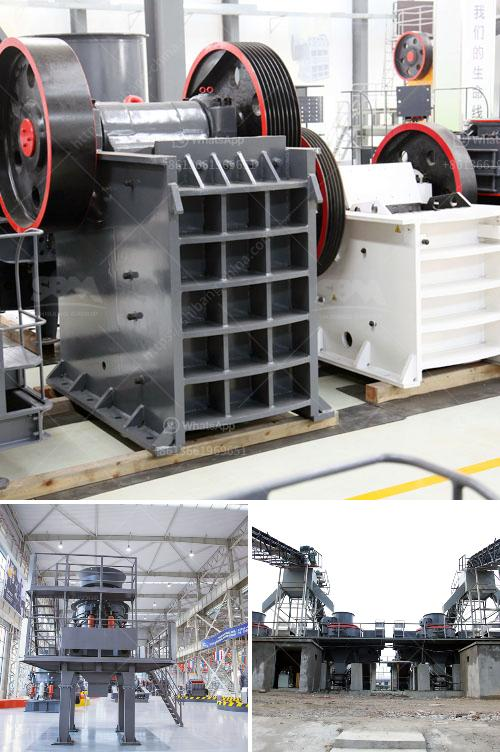

<h3>mineral pulverising ball mill manufacturer in india</h3>
Mineral pulverising ball mill manufacturer in India is one of the pioneers in the manufacture of ore dressing equipment. It is a technology leader in the manufacturing of ball mills for mineral pulverising, which are widely used in the mining industry for grinding material into a fine powder. India has abundant reserves of minerals such as limestone, iron ore, copper, coal, bauxite, and many others.

The mineral pulverising ball mill is used to grind many kinds of mine and other materials, or to select the mine. It is widely used in building material, chemical industry, etc. There are two ways of grinding: the dry process and the wet process. It can be divided into tabular type and flowing type according to different forms of discharging material.

The ball mill is a key equipment for regrinding. It is widely used for the cement, the silicate product, new type building material, fire-proof material, chemical fertilizer, black and non-ferrous metal, glass, ceramics, and etc. Our ball mill can grind ore or other materials that can be grinded either by wet process or by dry process.

There are also several types of ball mill available in the market depending on the capacity and fineness required. The ball mill has a rotating cylinder that is mounted horizontally and is controlled by an external motor. The cylinder is filled with grinding media like steel balls or rods. When the material is fed into the cylinder, it is ground into fine particles by the grinding media.

The mineral pulverising ball mill manufacturer in India offers various types of ball mills such as high energy ball mills, vibratory ball mills, planetary ball mills, attritor mills, horizontal ball mills, and attritor mills. These ball mills facilitate the size reduction of a wide variety of minerals such as iron, copper, bauxite, limestone, and many others.

The advantages of using a mineral pulverising ball mill in India are numerous. First, it offers excellent grinding efficiency. The grinding media in the ball mill crushes the material into fine particles which facilitate better mineral liberation and improved recovery rates in the subsequent processes. Second, ball mills are versatile and can be used for both dry and wet grinding. This ensures maximum flexibility for the operators to adapt to varying ore characteristics.

Thirdly, ball mills require low maintenance and operation costs. The mineral pulverising ball mill manufacturer in India ensures that their mills are of high quality and are designed to last long. Hence, maintenance and repair costs are significantly reduced, leading to overall cost savings for the mining operations.

In conclusion, the mineral pulverising ball mill manufacturer in India offers high-quality ball mills that are extensively used in the mining industry for grinding various minerals. The precise manufacturing techniques and strict quality control measures ensure consistent and reliable performance of these mills. With India's abundant mineral resources and the growing demand for processed minerals, the mineral pulverising ball mill manufacturer in India plays a vital role in the mining sector.
<h3>Contact us</h3><ul><li><strong>Whatsapp:&nbsp;<a href="https://wa.me/8613661969651">+8613661969651</a></strong></li><li><a href="https://swt.shibang-china.com/?git&amp;zhl&amp;mineral pulverising ball mill manufacturer in india"><strong>Online Service(chat now)</strong></a></li></ul><h3>Related</h3><ul><li><a href='price of zenith crusher.md'>price of zenith crusher</a></li><li><a href='pebble crusher shanghai manufacturers.md'>pebble crusher shanghai manufacturers</a></li><li><a href='100 tph stone crusher price.md'>100 tph stone crusher price</a></li><li><a href='crusher size reduction ratio.md'>crusher size reduction ratio</a></li><li><a href='sell stone crusher in philippines.md'>sell stone crusher in philippines</a></li></ul>