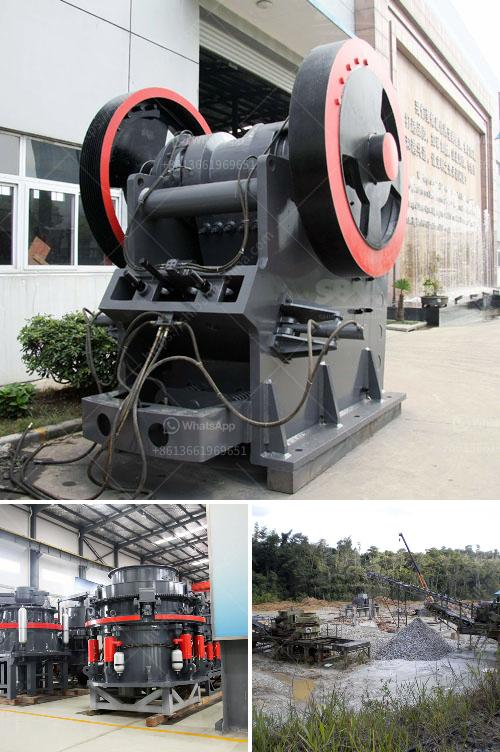

<h3>minerio de maquina de lavar maquina de lavar mineral</h3>
A máquina de lavar roupa é um eletrodoméstico indispensável em muitos lares, pois facilita a tarefa de lavar roupas de forma prática e eficiente. Mas você já ouviu falar em minério de máquina de lavar? Trata-se de uma substância que contribui para o melhor funcionamento da sua lavadora.

O minério de máquina de lavar, também conhecido como mineral de máquina de lavar, é um componente essencial para garantir que suas roupas fiquem limpas e sem manchas. Esse material é adicionado ao processo de lavagem para melhorar a eficácia do detergente, tornando-o ainda mais poderoso na remoção de sujeiras e resíduos.

A principal função desse minério é ajudar na quebra das partículas de sujeira presentes nas roupas, soltando-as dos tecidos e facilitando sua remoção durante o ciclo de lavagem. Isso garante que suas peças fiquem mais limpas e com um aspecto renovado.

Além disso, o mineral de máquina de lavar também atua como um suavizante natural, deixando as roupas mais macias e agradáveis ao toque. Ele ajuda a evitar o acúmulo de resíduos de detergente nas fibras dos tecidos, o que pode ocasionar o desgaste prematuro das peças.

Para utilizar corretamente o minério de máquina de lavar, basta seguir as instruções fornecidas pelo fabricante. Geralmente, é indicada uma quantidade específica a ser adicionada ao compartimento do detergente ou diretamente no tambor da máquina.

Com o uso do minério de máquina de lavar, você poderá desfrutar de roupas mais limpas e duráveis, além de um funcionamento otimizado do seu eletrodoméstico. Experimente adicionar esse mineral em sua próxima lavagem e surpreenda-se com os resultados!

Em suma, o minério de máquina de lavar é um aliado indispensável no processo de lavagem de roupas. Ele potencializa o poder do detergente, removendo manchas e sujeiras com mais facilidade. Além disso, proporciona roupas mais macias, prolongando sua vida útil. Invista nesse mineral e tenha resultados ainda melhores na limpeza do seu vestuário!
<h3>Contact us</h3><ul><li><strong>Whatsapp:&nbsp;<a href="https://wa.me/8613661969651">+8613661969651</a></strong></li><li><a href="https://swt.shibang-china.com/?git&amp;zhl&amp;minerio de maquina de lavar maquina de lavar mineral"><strong>Online Service(chat now)</strong></a></li></ul><h3>Related</h3><ul><li><a href='belt conveyor untuk batubara.md'>belt conveyor untuk batubara</a></li><li><a href='used jaw crushers from oman.md'>used jaw crushers from oman</a></li><li><a href='capacity of the ball mill and rod mill.md'>capacity of the ball mill and rod mill</a></li><li><a href='limestone crusher machine price.md'>limestone crusher machine price</a></li><li><a href='raymond gypsum mill in india.md'>raymond gypsum mill in india</a></li></ul>